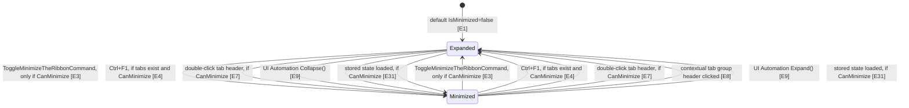
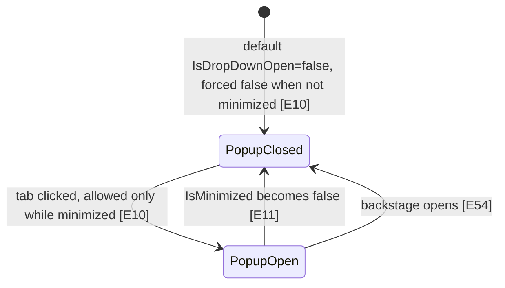
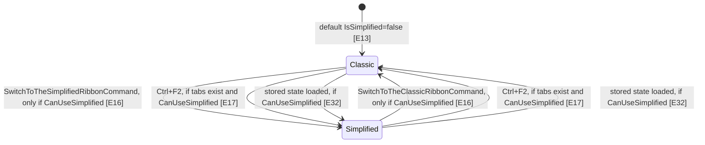
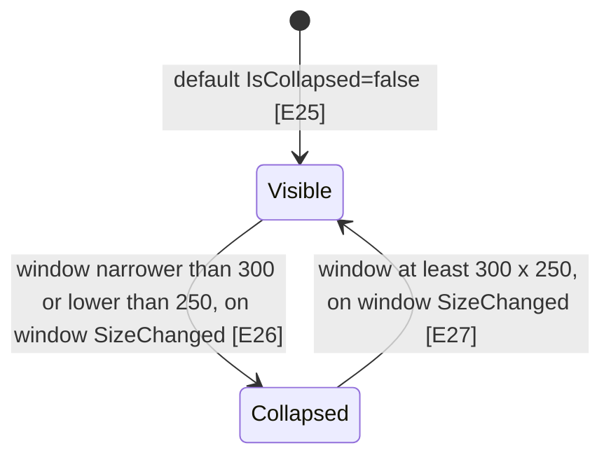
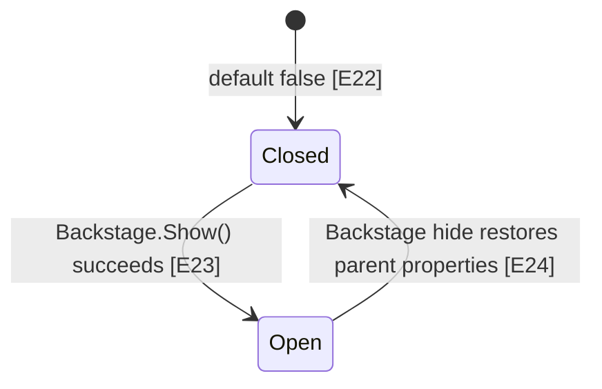
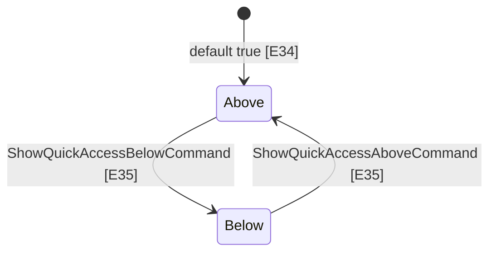
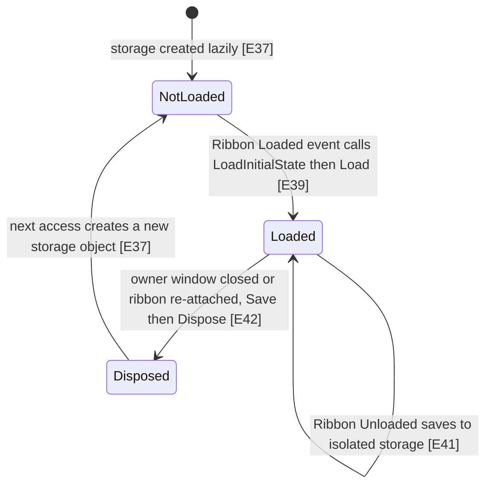

# Ribbon states

The Ribbon keeps a few on/off switches that decide how it looks: minimized (only the tab headers show, and a tab's content opens as a popup when clicked), simplified (a flatter, single-row layout), collapsed (hidden entirely because the window is too small), backstage/start screen open, and whether the Quick Access Toolbar sits above or below the ribbon. Three of them (minimized, Quick Access Toolbar position, simplified) are written to a small file on the user's machine and read back the next time the Ribbon loads. That saving and loading is on by default and can be turned off with `AutomaticStateManagement`.

## State diagram

IsMinimized (owned by `Ribbon`, mirrored two-way into `RibbonTabControl`):

Tab content popup (only meaningful while minimized):

IsSimplified (owned by `Ribbon`, pushed down to tabs, groups and controls):

IsCollapsed (automatic, based on owner window size):

IsBackstageOrStartScreenOpen (set by `Backstage`/`StartScreen`, not by `Ribbon`):

ShowQuickAccessToolBarAboveRibbon:

Persistent state storage lifecycle (`RibbonStateStorage`):

## Evidence

| ID | Claim | Location | Code |
|----|-------|----------|------|
| E1 | `Ribbon.IsMinimized` defaults to false and has a change callback. | `Fluent.Ribbon/Controls/Ribbon.cs:1053` | `typeof(Ribbon), new PropertyMetadata(BooleanBoxes.FalseBox, OnIsMinimizedChanged));` |
| E2 | Changing `Ribbon.IsMinimized` raises the `IsMinimizedChanged` event. | `Fluent.Ribbon/Controls/Ribbon.cs:1066` | `ribbon.IsMinimizedChanged?.Invoke(ribbon, e);` |
| E3 | The toggle-minimize command can execute only when `CanMinimize` is true, and it flips `IsMinimized`. | `Fluent.Ribbon/Controls/Ribbon.cs:1351` | `e.CanExecute = ribbon.CanMinimize;` |
| E4 | Ctrl+F1 on the owner window flips `IsMinimized` (after checking tabs exist and `CanMinimize`). | `Fluent.Ribbon/Controls/Ribbon.cs:1882` | `this.IsMinimized = !this.IsMinimized;` |
| E5 | `RibbonTabControl.IsMinimized` is bound two-way to the ancestor `Ribbon.IsMinimized` through its default style. | `Fluent.Ribbon/Themes/Controls/RibbonTabControl.xaml:118` | `<Setter Property="IsMinimized" Value="{Binding IsMinimized, RelativeSource={RelativeSource FindAncestor, AncestorType={x:Type Fluent:Ribbon}}, Mode=TwoWay}" />` |
| E6 | While minimized, the tab control template moves the selected content from the main area into the popup. | `Fluent.Ribbon/Themes/Controls/RibbonTabControl.xaml:308` | `<Trigger Property="IsMinimized" Value="True">` |
| E7 | Double-clicking a tab header flips `IsMinimized` on the `RibbonTabControl` if `CanMinimize`. | `Fluent.Ribbon/Controls/RibbonTabItem.cs:586` | `this.TabControlParent.IsMinimized = !this.TabControlParent.IsMinimized;` |
| E8 | Clicking a contextual tab group header un-minimizes the tab control. | `Fluent.Ribbon/Controls/RibbonContextualTabGroup.cs:301` | `firstVisibleItem.TabControlParent.IsMinimized = false;` |
| E9 | UI Automation Collapse sets `Ribbon.IsMinimized = true` (Expand sets it false two lines later). | `Fluent.Ribbon/Automation/Peers/RibbonAutomationPeer.cs:142` | `this.OwningRibbon.IsMinimized = true;` |
| E10 | `RibbonTabControl.IsDropDownOpen` is coerced to false when not minimized. | `Fluent.Ribbon/Controls/RibbonTabControl.cs:205` | `if (!tabControl.IsMinimized)` |
| E11 | When `RibbonTabControl.IsMinimized` becomes false, the drop-down popup is closed. | `Fluent.Ribbon/Controls/RibbonTabControl.cs:872` | `tabControl.IsDropDownOpen = false;` |
| E12 | `SelectFirstTab` does nothing while minimized. | `Fluent.Ribbon/Controls/RibbonTabControl.cs:846` | `if (this.IsMinimized)` |
| E13 | `Ribbon.IsSimplified` defaults to false and has a change callback. | `Fluent.Ribbon/Controls/Ribbon.cs:648` | `new PropertyMetadata(BooleanBoxes.FalseBox, OnIsSimplifiedChanged)` |
| E14 | When `Ribbon.IsSimplified` changes, every tab that implements `ISimplifiedStateControl` is told the new value; there is no `CanUseSimplified` check here. | `Fluent.Ribbon/Controls/Ribbon.cs:655` | `foreach (var item in ribbon.Tabs.OfType<ISimplifiedStateControl>())` |
| E15 | `CanUseSimplified` defaults to false and has no change callback or coercion. | `Fluent.Ribbon/Controls/Ribbon.cs:1083` | `DependencyProperty.Register(nameof(CanUseSimplified), typeof(bool), typeof(Ribbon), new PropertyMetadata(BooleanBoxes.FalseBox));` |
| E16 | The switch-to-classic/simplified commands can execute only when `CanUseSimplified` is true. | `Fluent.Ribbon/Controls/Ribbon.cs:1369` | `e.CanExecute = ribbon.CanUseSimplified;` |
| E17 | Ctrl+F2 flips `IsSimplified` only when `CanUseSimplified` is true. | `Fluent.Ribbon/Controls/Ribbon.cs:1895` | `this.IsSimplified = !this.IsSimplified;` |
| E18 | Tabs added to `Ribbon.Tabs` later receive the current simplified state. | `Fluent.Ribbon/Controls/Ribbon.cs:892` | `foreach (var item in e.NewItems.NullSafe().OfType<ISimplifiedStateControl>())` |
| E19 | A `RibbonTabItem` forwards its `IsSimplified` to all its groups when it changes. | `Fluent.Ribbon/Controls/RibbonTabItem.cs:436` | `item.UpdateSimplifiedState(isSimplified);` |
| E20 | A `RibbonGroupBox` resets its size state and re-applies child sizes when `IsSimplified` changes. | `Fluent.Ribbon/Controls/RibbonGroupBox.cs:657` | `box.TryClearCacheAndResetStateAndScaleAndNotifyParentRibbonGroupsContainer();` |
| E21 | In simplified mode the Ribbon template forces the tab content height to 42. | `Fluent.Ribbon/Themes/Controls/Ribbon.xaml:67` | `<Setter TargetName="PART_RibbonTabControl" Property="ContentHeight" Value="42" />` |
| E22 | `IsBackstageOrStartScreenOpen` defaults to false; its only side effect in `Ribbon` is re-measuring the title bar. | `Fluent.Ribbon/Controls/Ribbon.cs:562` | `ribbon.TitleBar?.ScheduleForceMeasureAndArrange();` |
| E23 | `Backstage.Show()` sets `IsBackstageOrStartScreenOpen` to true. | `Fluent.Ribbon/Controls/Backstage.cs:354` | `this.parentRibbon.SetCurrentValue(Ribbon.IsBackstageOrStartScreenOpenProperty, BooleanBoxes.TrueBox);` |
| E24 | `RestoreParentProperties` (run when the backstage finishes hiding) sets it back to false. | `Fluent.Ribbon/Controls/Backstage.cs:615` | `this.parentRibbon.SetCurrentValue(Ribbon.IsBackstageOrStartScreenOpenProperty, BooleanBoxes.FalseBox);` |
| E25 | `Ribbon.IsCollapsed` defaults to false and its callback only raises `IsCollapsedChanged`. | `Fluent.Ribbon/Controls/Ribbon.cs:1143` | `ribbon.IsCollapsedChanged?.Invoke(ribbon, e);` |
| E26 | `MaintainIsCollapsed` sets `IsCollapsed` true when the owner window is below the minimal size. | `Fluent.Ribbon/Controls/Ribbon.cs:1583` | `this.SetCurrentValue(IsCollapsedProperty, BooleanBoxes.TrueBox);` |
| E27 | Otherwise it sets `IsCollapsed` false. | `Fluent.Ribbon/Controls/Ribbon.cs:1587` | `this.SetCurrentValue(IsCollapsedProperty, BooleanBoxes.FalseBox);` |
| E28 | The limits are 300 wide and 250 high. | `Fluent.Ribbon/Controls/Ribbon.cs:60` | `public const double MinimalVisibleWidth = 300;` |
| E29 | `MaintainIsCollapsed` does nothing when `IsAutomaticCollapseEnabled` is false or there is no owner window. | `Fluent.Ribbon/Controls/Ribbon.cs:1574` | `if (this.IsAutomaticCollapseEnabled == false` |
| E30 | `MaintainIsCollapsed` runs on the owner window's `SizeChanged` (subscribed in `AttachToWindow`). | `Fluent.Ribbon/Controls/Ribbon.cs:1708` | `this.ownerWindow.SizeChanged += this.OnSizeChanged;` |
| E31 | Loading stored state sets `IsMinimized` only if `CanMinimize`. | `Fluent.Ribbon/Data/RibbonStateStorage.cs:263` | `if (this.ribbon.CanMinimize` |
| E32 | Loading stored state sets `IsSimplified` only if `CanUseSimplified`. | `Fluent.Ribbon/Data/RibbonStateStorage.cs:284` | `if (this.ribbon.CanUseSimplified` |
| E33 | When collapsed, the Ribbon template hides the tab control and the below-ribbon QAT holder. | `Fluent.Ribbon/Themes/Controls/Ribbon.xaml:55` | `<Setter TargetName="PART_RibbonTabControl" Property="Visibility" Value="Collapsed" />` |
| E34 | `ShowQuickAccessToolBarAboveRibbon` defaults to true. | `Fluent.Ribbon/Controls/Ribbon.cs:812` | `new PropertyMetadata(BooleanBoxes.TrueBox, OnShowQuickAccessToolBarAboveRibbonChanged)` |
| E35 | The show-QAT-below command sets the property to false (the above command sets it true at line 1414). | `Fluent.Ribbon/Controls/Ribbon.cs:1401` | `ribbon.ShowQuickAccessToolBarAboveRibbon = false;` |
| E36 | Changing the QAT position writes the state to the in-memory temporary stream. | `Fluent.Ribbon/Controls/Ribbon.cs:837` | `ribbon.RibbonStateStorage.SaveTemporary();` |
| E37 | The storage object is created lazily through a virtual factory method. | `Fluent.Ribbon/Controls/Ribbon.cs:44` | `public IRibbonStateStorage RibbonStateStorage => this.ribbonStateStorage ??= this.CreateRibbonStateStorage();` |
| E38 | Saved data is exactly `IsMinimized,ShowQuickAccessToolBarAboveRibbon,IsSimplified` (IsMinimized first). | `Fluent.Ribbon/Data/RibbonStateStorage.cs:161` | `builder.Append(this.ribbon.IsMinimized.ToString(CultureInfo.InvariantCulture));` |
| E39 | The Ribbon's `Loaded` handler attaches to the window and loads initial state. | `Fluent.Ribbon/Controls/Ribbon.cs:1865` | `this.LoadInitialState();` |
| E40 | `LoadInitialState` returns early if state was already loaded. | `Fluent.Ribbon/Controls/Ribbon.cs:1938` | `if (this.RibbonStateStorage.IsLoaded)` |
| E41 | The Ribbon's `Unloaded` handler saves state. | `Fluent.Ribbon/Controls/Ribbon.cs:1907` | `this.RibbonStateStorage.Save();` |
| E42 | `DetachFromWindow` saves, disposes and drops the storage object. | `Fluent.Ribbon/Controls/Ribbon.cs:1719` | `this.ribbonStateStorage = null;` |
| E43 | `Save()` does nothing when `AutomaticStateManagement` is false. | `Fluent.Ribbon/Data/RibbonStateStorage.cs:105` | `if (this.ribbon.AutomaticStateManagement == false)` |
| E44 | `Save()` does nothing if state was not loaded first. | `Fluent.Ribbon/Data/RibbonStateStorage.cs:111` | `if (this.IsLoaded == false)` |
| E45 | `Load()` marks the state as loaded even when `AutomaticStateManagement` is false and nothing was read. | `Fluent.Ribbon/Data/RibbonStateStorage.cs:191` | `this.IsLoaded = true;` |
| E46 | The storage file name is `Fluent.Ribbon.State.` plus a hash of window type, window name and ribbon name, cached after first use. | `Fluent.Ribbon/Data/RibbonStateStorage.cs:89` | `this.isolatedStorageFileName = "Fluent.Ribbon.State." + BitConverter.ToInt32(` |
| E47 | `AutomaticStateManagement` is coerced to false while the storage is loading. | `Fluent.Ribbon/Controls/Ribbon.cs:1974` | `return BooleanBoxes.FalseBox;` |
| E48 | Setting `AutomaticStateManagement` to true calls `LoadInitialState`. | `Fluent.Ribbon/Controls/Ribbon.cs:1985` | `ribbon.LoadInitialState();` |
| E49 | `SaveTemporary` rewinds the memory stream to 0 and writes, without truncating it. | `Fluent.Ribbon/Data/RibbonStateStorage.cs:97` | `this.memoryStream.Position = 0;` |
| E50 | `Reset()` deletes every isolated storage file matching `*Fluent.Ribbon.State*`. | `Fluent.Ribbon/Data/RibbonStateStorage.cs:323` | `foreach (var filename in storage.GetFileNames("*Fluent.Ribbon.State*"))` |
| E51 | `Backstage.Hide()` returns without restoring parent properties if the adorner is null. | `Fluent.Ribbon/Controls/Backstage.cs:404` | `this.adorner is null)` |
| E52 | When the backstage is unloaded, its adorner is destroyed (set to null). | `Fluent.Ribbon/Controls/Backstage.cs:725` | `this.DestroyAdorner();` |
| E53 | `StartScreen.Show()` refuses to show again once `Shown` is true; `Hide()` never resets `Shown`. | `Fluent.Ribbon/Controls/StartScreen.cs:63` | `if (this.Shown)` |
| E54 | `Backstage.Show()` closes the minimized-ribbon tab popup. | `Fluent.Ribbon/Controls/Backstage.cs:349` | `this.parentRibbon.TabControl.IsDropDownOpen = false;` |

## Invariants

- `Ribbon.IsMinimized` and `RibbonTabControl.IsMinimized` must stay the same value. The only link is the two-way binding in the `RibbonTabControl` default style; a custom `RibbonTabControl` style that drops that setter breaks it [E5]. Code that minimizes from inside the tab control (double-click, contextual group click) writes to `RibbonTabControl.IsMinimized`, not to `Ribbon.IsMinimized`, and relies on that binding to reach the Ribbon and the saved state [E7, E8, E38].
- The same holds for `IsSimplified`: `RibbonTabControl.IsSimplified` is only a mirror and has no callback; the push down to tabs happens only in `Ribbon.OnIsSimplifiedChanged` and in the `Tabs` collection-changed handler [E13, E14, E18]. Tabs pass it to groups, groups to their child controls [E19, E20].
- The tab popup (`IsDropDownOpen`) can only be true while minimized, enforced by coercion and by closing it on un-minimize [E10, E11].
- `CanMinimize` and `CanUseSimplified` are checked by the commands, the keyboard shortcuts, the tab double-click and the state loader, but not by the `IsMinimized`/`IsSimplified` properties themselves [E3, E4, E7, E15, E16, E17, E31, E32].
- `Save()` refuses to write until `Load()` has run once for the current storage object; this prevents an unloaded default state from overwriting the file [E44, E45].
- A new storage object is created after every `DetachFromWindow`, so the "loaded" flag resets and the next `Loaded` event reads the file again [E37, E39, E40, E42].
- `IsCollapsed` is only recalculated on the owner window's `SizeChanged` or when `IsAutomaticCollapseEnabled` changes; there must be an owner window [E29, E30].
- The storage file name depends on window type, window name and ribbon name; renaming any of them makes the old saved state invisible [E46].
- `IsBackstageOrStartScreenOpen` is set only by `Backstage` (and `StartScreen`, which derives from it); the Ribbon itself never sets it [E22, E23, E24].

## How app code should interact

- Minimize/expand: set `Ribbon.IsMinimized`, or execute `Ribbon.ToggleMinimizeTheRibbonCommand` which respects `CanMinimize` [E1, E3]. Listen with the `IsMinimizedChanged` event [E2]. Set `CanMinimize=false` to block the user paths [E3, E4, E7].
- Simplified layout: set `CanUseSimplified=true` first (default is false) [E15], then set `Ribbon.IsSimplified` or execute `SwitchToTheSimplifiedRibbonCommand` / `SwitchToTheClassicRibbonCommand` [E13, E16]. Tabs added later pick up the current value automatically [E18].
- Auto-collapse: read `Ribbon.IsCollapsed` or handle `IsCollapsedChanged`; turn the automatic behaviour off with `IsAutomaticCollapseEnabled=false` [E25, E29].
- Backstage/start screen: open and close through the `Backstage.IsOpen` property; treat `Ribbon.IsBackstageOrStartScreenOpen` as read-only status [E23, E24]. A `StartScreen` shows once; to show it again the app must set `StartScreen.Shown=false` [E53].
- QAT position: set `ShowQuickAccessToolBarAboveRibbon` or execute `ShowQuickAccessAboveCommand` / `ShowQuickAccessBelowCommand` [E34, E35].
- Persistence: leave `AutomaticStateManagement=true` (default) for automatic load on `Loaded` and save on `Unloaded`/window close [E39, E41, E42]; set it to false to disable both [E43, E45]. Call `Ribbon.RibbonStateStorage.Reset()` to delete saved files [E50]. To store more or different data, override `Ribbon.CreateRibbonStateStorage()` and return a subclass of `RibbonStateStorage` (its `CreateStateData`/`LoadState` are `protected virtual`) or another `IRibbonStateStorage` [E37, E38].
- Give the window and/or the Ribbon a `Name` if several ribbons of the same window type must keep separate saved state [E46].

## Suspicious findings (unverified)

These are candidates found by reading the code. None has been confirmed by running it.

1. **`LoadTemporary` is never called.** `Fluent.Ribbon/Data/RibbonStateStorage.cs:171` defines it, and `Fluent.Ribbon/Controls/Ribbon.cs:837` writes to the temporary stream, but a repo-wide grep finds no caller of `LoadTemporary` in `Fluent.Ribbon/`. Also, `SaveTemporary` is only called when the QAT position changes, not when `IsMinimized` or `IsSimplified` change. The comment at `RibbonStateStorage.cs:204-205` says the temporary copy exists to reapply state after style changes, but nothing does that. Test: grep for callers; change a theme at runtime and check whether minimized/simplified survive.
2. **Temporary stream is not truncated.** `RibbonStateStorage.cs:97` (and `:207`) set `Position = 0` and write, without `SetLength`. Writing `True,...` (shorter) after `False,...` leaves old trailing bytes, so a later `LoadTemporary` could read e.g. `Falsee` for the last field and skip `IsSimplified`. Test: call `SaveTemporary` with `IsMinimized=false`, then with `true`, then read the stream.
3. **Tab double-click writes to a style-bound property.** `RibbonTabItem.cs:586` and `RibbonContextualTabGroup.cs:301` call the CLR setter (`SetValue`) on `RibbonTabControl.IsMinimized`, whose value comes from a two-way binding set in a Style (`RibbonTabControl.xaml:118`). Whether a local `SetValue` updates the source through a style-applied binding, or replaces it, is WPF behaviour not shown in this repo. If it replaces it, `Ribbon.IsMinimized` (the value that is saved, E38) would stop tracking the tab control after the first double-click. Test: double-click a tab, then read `Ribbon.IsMinimized` and `BindingOperations.GetBindingExpression(tabControl, RibbonTabControl.IsMinimizedProperty)`.
4. **`IsSimplified`/`IsMinimized` ignore `CanUseSimplified`/`CanMinimize` when set directly.** `Ribbon.cs:650-659` pushes `IsSimplified` to all tabs without checking `CanUseSimplified`, while commands, Ctrl+F2 and `LoadState` all check it (E16, E17, E32). Turning `CanUseSimplified` off while simplified leaves the ribbon simplified with the switch menu items hidden (`RibbonTabControl.xaml:219-229` bind visibility to `CanUseSimplified`), so the user has no UI path back. Test: set `IsSimplified=true`, then `CanUseSimplified=false`.
5. **Backstage unloaded while open can leave `IsBackstageOrStartScreenOpen` stuck at true.** `Backstage.cs:725` destroys the adorner on unload; a later close goes through `Hide()`, which returns at `Backstage.cs:404` when `adorner is null`, so `RestoreParentProperties` (`Backstage.cs:615`) never runs. The Ribbon template then keeps the QAT hidden (`Ribbon.xaml:50-52`). Test: open the backstage, remove it from the tree (or change `Ribbon.Menu`), set `IsOpen=false`, and read `Ribbon.IsBackstageOrStartScreenOpen`.
6. **`IsCollapsed` is not computed on attach.** `AttachToWindow` (`Ribbon.cs:1698-1710`) subscribes to `SizeChanged` but does not call `MaintainIsCollapsed`. A Ribbon loaded into a window that is already small and is not resized afterwards (for example, a Ribbon added at runtime, or re-loaded after `Unloaded`) stays not-collapsed until the next resize. Test: add a Ribbon to an already-open 200x200 window and read `IsCollapsed`.
7. **Enabling `AutomaticStateManagement` after load does not load.** `OnAutomaticStateManagementChanged` (`Ribbon.cs:1985`) calls `LoadInitialState`, which exits when `IsLoaded` (`Ribbon.cs:1938`), and `Load()` sets `IsLoaded=true` even when management was disabled (`RibbonStateStorage.cs:191`). So false-then-true after `Loaded` never reads the file, but the next `Save()` will overwrite it. Test: start with `AutomaticStateManagement=false`, set true after load, check that saved state was not applied and the file was overwritten on close.
8. **Coercion of `AutomaticStateManagement` is never re-evaluated.** `CoerceAutomaticStateManagement` (`Ribbon.cs:1972-1974`) returns false during loading, but nothing calls `CoerceValue` after loading ends, so a value set during load stays false. Low impact; only hit if a handler of `IsMinimizedChanged` etc. sets it during load. Test: set `AutomaticStateManagement=true` inside an `IsMinimizedChanged` handler fired by `Load`.
9. **Two separate auto-collapse implementations.** `Ribbon.MaintainIsCollapsed` (`Ribbon.cs:1572`) and `RibbonWindow.MaintainIsCollapsed` (`RibbonWindow.cs:243`) compute the same thing independently; the code itself has a todo about merging them (`Ribbon.cs:1124`). They differ: the Ribbon version needs an owner window, the window version does not. Not a bug by itself, but the two `IsCollapsed` values can disagree if only one has `IsAutomaticCollapseEnabled=false`.

## Open questions

- Whether `MenuItem.IsChecked` bindings in the display-options menu (`RibbonTabControl.xaml:206`, `:210`, `:224`, `:228`, no explicit `Mode`) write back to `IsMinimized`/`IsSimplified` depends on the WPF default binding mode of `MenuItem.IsChecked`, which is not defined in this repo.
- Whether `SetValue` on a property with a Style-applied two-way binding updates the source (see suspicious finding 3) is WPF framework behaviour; not provable from this code.
- Why `RibbonTabControl` also has its own `CanMinimize`/`CanUseSimplified` bound two-way (`RibbonTabControl.xaml:113-114`): nothing found in the tab control that writes them, so the purpose of `Mode=TwoWay` is unclear.
- Whether any app-facing code path (outside `Fluent.Ribbon/`) is expected to call `LoadTemporary`; the Showcase only calls `Reset()` (`Fluent.Ribbon.Showcase/TestContent.xaml.cs:597`).
- Order of `Loaded` events: if the Ribbon's `Loaded` fires before `OnApplyTemplate` has set `TabControl`, `LoadInitialState`'s `SelectFirstTab` call (`Ribbon.cs:1945-1948`) is skipped. Not determinable from code alone.
