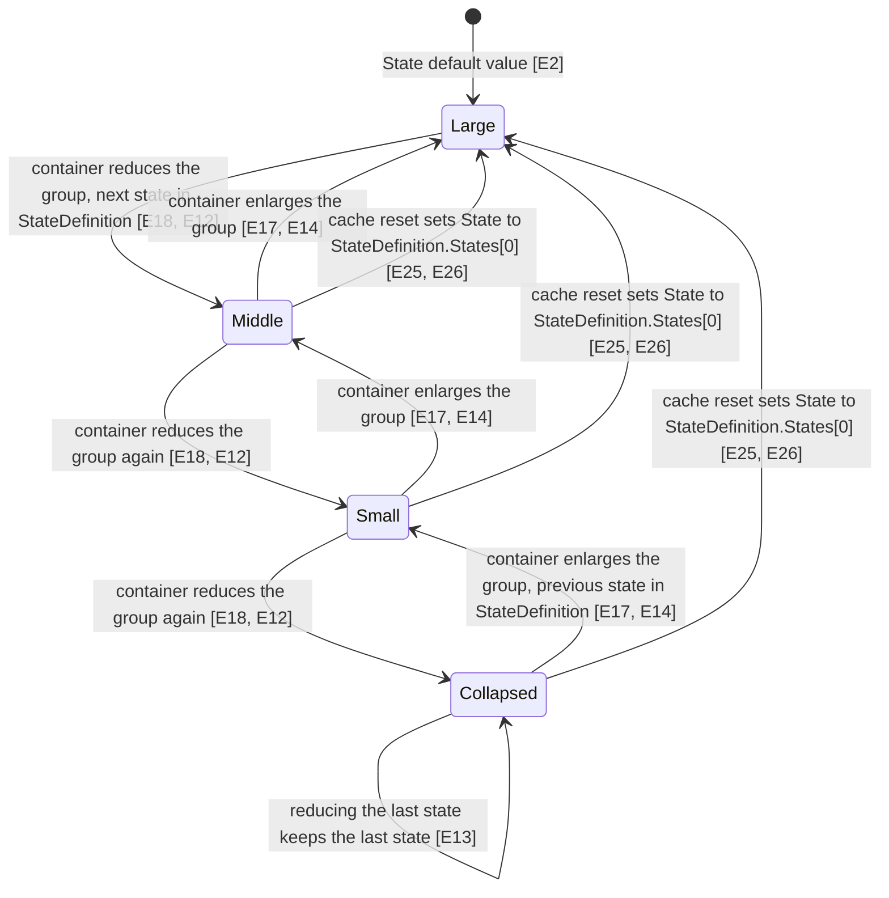
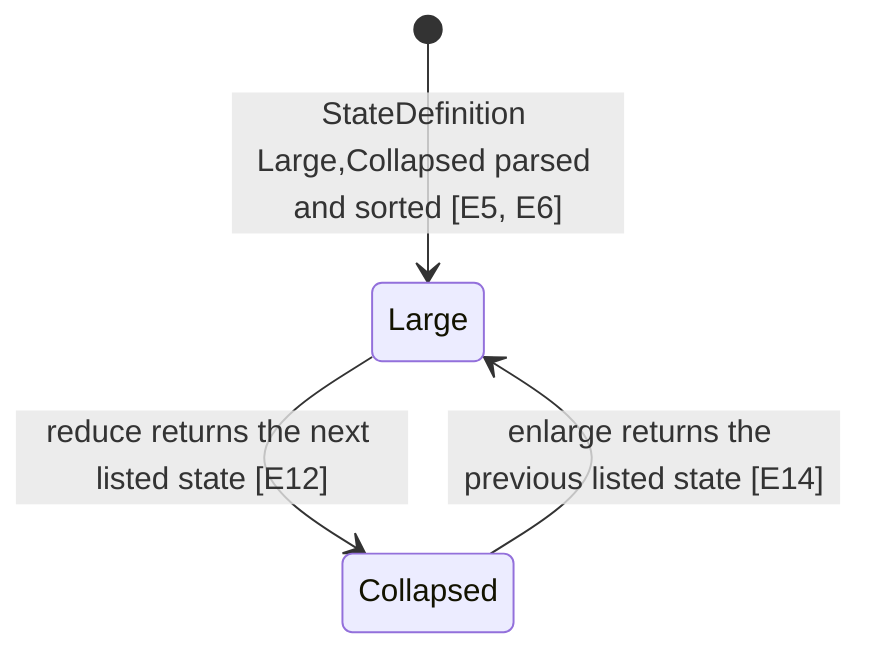
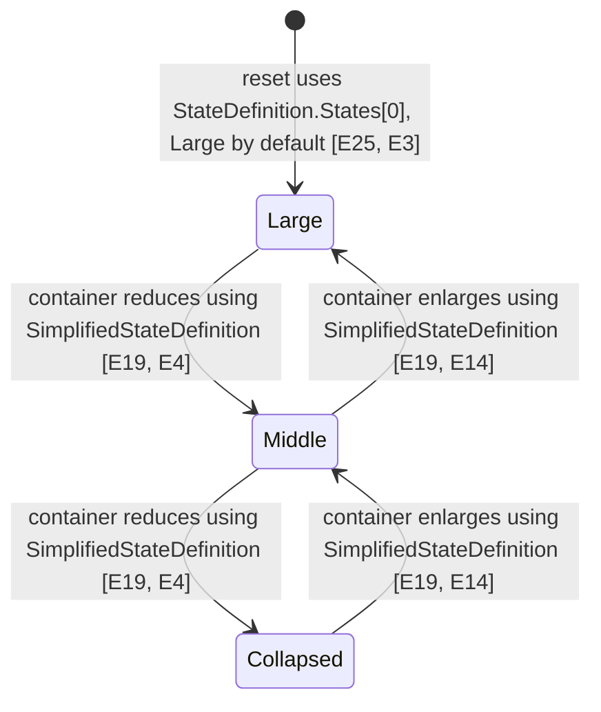
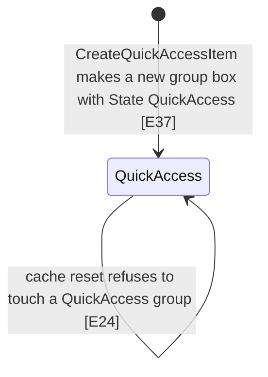
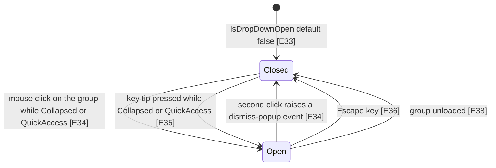

# Group resizing

When a ribbon tab is too narrow for its groups, Fluent.Ribbon shrinks groups one step at a time, in an order the app gives on the tab (`ReduceOrder`). Each step moves one named group to its next smaller state (Large, Middle, Small, Collapsed) or shrinks its scalable controls, such as an in-ribbon gallery. When space comes back, the same steps are undone in reverse order. If the app gives no `ReduceOrder`, groups are never shrunk automatically; the tab scrolls sideways instead.

## State diagram

Classic (not simplified) ribbon, with the default `StateDefinition` (Large, Middle, Small, Collapsed). "Reduce" and "enlarge" steps only happen for a group whose `Name` appears in the tab's `ReduceOrder`; each occurrence of the name is one step.

A custom `StateDefinition` changes which states exist. States are sorted large to small and steps skip states that are not listed, e.g. `"Large,Collapsed"` goes straight from Large to Collapsed.

Simplified ribbon (`IsSimplified` true), with the default `SimplifiedStateDefinition` (Large, Middle, Collapsed). The container uses `SimplifiedStateDefinition` for steps, but the reset still uses `StateDefinition` (see Suspicious findings, S1).

QuickAccess is a separate state used only by the copy of a group placed in the Quick Access Toolbar.

Drop-down of a Collapsed (or QuickAccess) group:

## Evidence

| ID | Claim | Location | Code |
|---|---|---|---|
| E1 | The group states are an enum in the order Large=0, Middle, Small, Collapsed, QuickAccess. | `Fluent.Ribbon/Enumerations/RibbonGroupBoxState.cs:12` | `Large = 0,` |
| E2 | `State` is a dependency property whose default is Large and whose change handler is OnStateChanged. | `Fluent.Ribbon/Controls/RibbonGroupBox.cs:189` | `new PropertyMetadata(RibbonGroupBoxState.Large, OnStateChanged)` |
| E3 | The default `StateDefinition` is built from a null string, which means the built-in default list. | `Fluent.Ribbon/Controls/RibbonGroupBox.cs:134` | `new PropertyMetadata(new RibbonGroupBoxStateDefinition(null), OnStateDefinitionChanged)` |
| E4 | The default `SimplifiedStateDefinition` is "Large,Middle,Collapsed". | `Fluent.Ribbon/Controls/RibbonGroupBox.cs:162` | `new PropertyMetadata(new RibbonGroupBoxStateDefinition("Large,Middle,Collapsed"), OnSimplifiedStateDefinitionChanged)` |
| E5 | A state definition string is split on space, comma, semicolon, dash and '>' into at most 4 parts. | `Fluent.Ribbon/Data/RibbonGroupBoxStateDefinition.cs:40` | `stateDefinition!.Split(stateDefinitionSeparators, MaxStateDefinitionParts, StringSplitOptions.RemoveEmptyEntries)` |
| E6 | Parsed states are sorted by enum value (large to small), so the order written in the string does not matter. | `Fluent.Ribbon/Data/RibbonGroupBoxStateDefinition.cs:67` | `newStates.Sort();` |
| E7 | QuickAccess is never accepted into a state definition. | `Fluent.Ribbon/Data/RibbonGroupBoxStateDefinition.cs:53` | `if (state != RibbonGroupBoxState.QuickAccess)` |
| E8 | An unknown state name is parsed as Large. | `Fluent.Ribbon/Data/RibbonGroupBoxStateDefinition.cs:110` | `: RibbonGroupBoxState.Large;` |
| E9 | A null or empty definition keeps the default list Large, Middle, Small, Collapsed. | `Fluent.Ribbon/Data/RibbonGroupBoxStateDefinition.cs:33` | `this.states = defaultStates;` |
| E10 | The default list contains Small (full list is Large, Middle, Small, Collapsed). | `Fluent.Ribbon/Data/RibbonGroupBoxStateDefinition.cs:21` | `RibbonGroupBoxState.Small,` |
| E11 | `RibbonTabItem.ReduceOrder` is a plain wrapper around the ReduceOrder of its internal RibbonGroupsContainer. | `Fluent.Ribbon/Controls/RibbonTabItem.cs:114` | `set => this.groupsInnerContainer.ReduceOrder = value;` |
| E12 | ReduceState returns the next state in the (sorted) list. | `Fluent.Ribbon/Data/RibbonGroupBoxStateDefinition.cs:158` | `return currentStates[index + 1];` |
| E13 | ReduceState on the last listed state returns the last listed state. | `Fluent.Ribbon/Data/RibbonGroupBoxStateDefinition.cs:162` | `return currentStates[currentStates.Length - 1];` |
| E14 | EnlargeState returns the previous state in the list (and States[0] when already first). | `Fluent.Ribbon/Data/RibbonGroupBoxStateDefinition.cs:124` | `return this.States[index - 1];` |
| E15 | ReduceOrder is split on comma and space; each entry is one reduction step. | `Fluent.Ribbon/Controls/RibbonGroupsContainer.cs:69` | `Split(new[] { ',', ' ' }, StringSplitOptions.RemoveEmptyEntries)` |
| E16 | Measuring returns immediately (no reducing or enlarging) when ReduceOrder is empty. | `Fluent.Ribbon/Controls/RibbonGroupsContainer.cs:112` | `if (this.reduceOrder.Length == 0` |
| E17 | While there is room, the container advances reduceOrderIndex and enlarges the entry at the new index. | `Fluent.Ribbon/Controls/RibbonGroupsContainer.cs:131` | `this.IncreaseGroupBoxSize(this.reduceOrder[this.reduceOrderIndex]);` |
| E18 | While too wide, the container reduces the entry at reduceOrderIndex and then decrements the index, so the last entry of ReduceOrder is reduced first. | `Fluent.Ribbon/Controls/RibbonGroupsContainer.cs:146` | `this.DecreaseGroupBoxSize(this.reduceOrder[this.reduceOrderIndex]);` |
| E19 | For a simplified group the container uses SimplifiedStateDefinition to reduce (and to enlarge, line 199). | `Fluent.Ribbon/Controls/RibbonGroupsContainer.cs:227` | `groupBox.StateIntermediate = groupBox.SimplifiedStateDefinition.ReduceState(groupBox.StateIntermediate);` |
| E20 | An entry written as (Name) changes the group's ScaleIntermediate instead of its state. | `Fluent.Ribbon/Controls/RibbonGroupsContainer.cs:221` | `groupBox.ScaleIntermediate--;` |
| E21 | Entries are matched to groups by FrameworkElement.Name; an unmatched entry does nothing. | `Fluent.Ribbon/Controls/RibbonGroupsContainer.cs:245` | `if (child?.Name == name)` |
| E22 | Measuring the container applies StateIntermediate and ScaleIntermediate to the real State and Scale, then measures the group with infinite width. | `Fluent.Ribbon/Controls/RibbonGroupBox.cs:885` | `this.State = this.StateIntermediate;` |
| E23 | That trial measure runs inside CacheResetGuard. | `Fluent.Ribbon/Controls/RibbonGroupBox.cs:882` | `using (this.CacheResetGuard.Start())` |
| E24 | A reset is refused while the guard is active or when the group is in QuickAccess state. | `Fluent.Ribbon/Controls/RibbonGroupBox.cs:896` | `this.State == RibbonGroupBoxState.QuickAccess)` |
| E25 | The reset sets State to the first state of StateDefinition, even when the group is simplified (this checkout does not contain the SimplifiedStateDefinition fix). | `Fluent.Ribbon/Controls/RibbonGroupBox.cs:901` | `this.State = this.StateDefinition.States[0];` |
| E26 | The reset also sets StateIntermediate to StateDefinition.States[0] and resets scalable items. | `Fluent.Ribbon/Controls/RibbonGroupBox.cs:903` | `this.StateIntermediate = this.StateDefinition.States[0];` |
| E27 | After a successful reset the group tells its parent RibbonGroupsContainer. | `Fluent.Ribbon/Controls/RibbonGroupBox.cs:923` | `UIHelper.GetParent<RibbonGroupsContainer>(this)?.GroupBoxCacheClearedAndStateAndScaleResetted(this);` |
| E28 | The container ignores that notification if its measure cache is empty. | `Fluent.Ribbon/Controls/RibbonGroupsContainer.cs:585` | `if (this.measureCache.IsEmpty)` |
| E29 | Otherwise it clears the cache, moves reduceOrderIndex back to the last entry and resets every other group. | `Fluent.Ribbon/Controls/RibbonGroupsContainer.cs:604` | `groupBox.TryClearCacheAndResetStateAndScale();` |
| E30 | The measure cache is only written after the reduce/enlarge loops ran. | `Fluent.Ribbon/Controls/RibbonGroupsContainer.cs:152` | `this.measureCache = new MeasureCache(availableSize, desiredSize);` |
| E31 | A cache hit (same available size and same summed desired size) skips the loops. | `Fluent.Ribbon/Controls/RibbonGroupsContainer.cs:114` | `this.measureCache.AvailableSize == availableSize && this.measureCache.DesiredSize == desiredSize` |
| E32 | When the index runs out the reduce loop stops and the container falls back to horizontal scrolling. | `Fluent.Ribbon/Controls/RibbonGroupsContainer.cs:139` | `var hasMoreVariants = this.reduceOrderIndex >= 0;` |
| E33 | IsDropDownOpen is coerced to false unless the group is Collapsed or QuickAccess. | `Fluent.Ribbon/Controls/RibbonGroupBox.cs:555` | `return BooleanBoxes.Box(false);` |
| E34 | A left click on a Collapsed or QuickAccess group opens the drop-down, or dismisses it when open. | `Fluent.Ribbon/Controls/RibbonGroupBox.cs:1022` | `PopupService.RaiseDismissPopupEventAsync(this, DismissPopupMode.MouseNotOver);` |
| E35 | Pressing the group's key tip opens the drop-down only in Collapsed or QuickAccess state. | `Fluent.Ribbon/Controls/RibbonGroupBox.cs:1285` | `if (this.State is RibbonGroupBoxState.Collapsed or RibbonGroupBoxState.QuickAccess)` |
| E36 | In button state, Escape closes the drop-down (Space and Alt+Down open it). | `Fluent.Ribbon/Controls/RibbonGroupBox.cs:1057` | `this.IsDropDownOpen = false;` |
| E37 | The Quick Access Toolbar copy of a group is a new RibbonGroupBox with State QuickAccess. | `Fluent.Ribbon/Controls/RibbonGroupBox.cs:1167` | `var groupBox = new RibbonGroupBox { State = RibbonGroupBoxState.QuickAccess };` |
| E38 | Unloading a group closes its drop-down. | `Fluent.Ribbon/Controls/RibbonGroupBox.cs:747` | `this.SetCurrentValue(IsDropDownOpenProperty, false);` |
| E39 | In the Collapsed state the template hides the normal content and puts PART_ParentPanel into the popup. | `Fluent.Ribbon/Themes/Controls/RibbonGroupBox.xaml:377` | `<Setter TargetName="popupContent" Property="Content" Value="{Binding ElementName=PART_ParentPanel}" />` |
| E40 | A State change queues UpdateChildSizes (run once item containers are generated). | `Fluent.Ribbon/Controls/RibbonGroupBox.cs:199` | `ribbonGroupBox.updateChildSizesItemContainerGeneratorAction.QueueAction();` |
| E41 | UpdateChildSizes treats QuickAccess as Collapsed. | `Fluent.Ribbon/Controls/RibbonGroupBox.cs:206` | `? RibbonGroupBoxState.Collapsed` |
| E42 | Each child's Size comes from its SimplifiedSizeDefinition (simplified) or SizeDefinition (classic). | `Fluent.Ribbon/AttachedProperties/RibbonProperties.cs:134` | `var sizeDefinition = isSimplified ? GetSimplifiedSizeDefinition(element) : GetSizeDefinition(element);` |
| E43 | The default SizeDefinition is Large, Middle, Small. | `Fluent.Ribbon/AttachedProperties/RibbonProperties.cs:66` | `new FrameworkPropertyMetadata(new RibbonControlSizeDefinition(RibbonControlSize.Large, RibbonControlSize.Middle, RibbonControlSize.Small),` |
| E44 | In Collapsed and QuickAccess state children use the size defined for Large. | `Fluent.Ribbon/Data/RibbonControlSizeDefinition.cs:132` | `return this.Large;` |
| E45 | A SizeDefinition with fewer than 3 parts repeats its last part. | `Fluent.Ribbon/Data/RibbonControlSizeDefinition.cs:57` | `sizeDefinitionParts.Add(sizeDefinitionParts[sizeDefinitionParts.Count - 1]);` |
| E46 | Changing StateDefinition resets the group only when it is not simplified. | `Fluent.Ribbon/Controls/RibbonGroupBox.cs:140` | `if (!box.IsSimplified)` |
| E47 | Changing SimplifiedStateDefinition resets the group only when it is simplified. | `Fluent.Ribbon/Controls/RibbonGroupBox.cs:168` | `if (box.IsSimplified)` |
| E48 | Items changes, visibility, font size, font family, IsSimplified and template application all trigger a reset plus parent notification (items shown here). | `Fluent.Ribbon/Controls/RibbonGroupBox.cs:998` | `this.TryClearCacheAndResetStateAndScaleAndNotifyParentRibbonGroupsContainer();` |
| E49 | A child desired-size change on a measured container resets all groups via the container. | `Fluent.Ribbon/Controls/RibbonGroupsContainer.cs:579` | `this.GroupBoxCacheClearedAndStateAndScaleResetted(null);` |
| E50 | Changing ReduceOrder first enlarges every entry from reduceOrderIndex onward, then moves the index to the new last entry. | `Fluent.Ribbon/Controls/RibbonGroupsContainer.cs:62` | `var toIncrease = ribbonPanel.reduceOrder.Skip(ribbonPanel.reduceOrderIndex).ToArray();` |
| E51 | The XML doc of ReduceOrder says entries go from the first to reduce to the last to reduce. | `Fluent.Ribbon/Controls/RibbonGroupsContainer.cs:42` | `It must be enumerated with comma from the first to reduce to` |
| E52 | The Showcase comment says the opposite: names are listed from the last to the first to reduce. | `Fluent.Ribbon.Showcase/TestContent.xaml:2536` | `You can enumerate group names from the last to first to reduce.` |
| E53 | A test sets State to Large directly and then expects Middle, i.e. the container overwrites a directly set State. | `Fluent.Ribbon.Tests/Controls/RibbonGroupBoxTests.cs:127` | `ribbonGroupBox.State = RibbonGroupBoxState.Large;` |
| E54 | Scaling skips scalable controls that are not Visible. | `Fluent.Ribbon/Controls/RibbonGroupBox.cs:309` | `(scalableRibbonControl is UIElement uiElement && uiElement.Visibility != Visibility.Visible))` |

## Invariants

- `State` is not an input when a group sits in a `RibbonGroupsContainer` with a `ReduceOrder`: every container measure copies `StateIntermediate` into `State` [E22, E53]. Code that sets `State` directly is overwritten.
- `StateIntermediate` and `ScaleIntermediate` are the working values; the container only changes those, and the group applies them during its trial measure [E17, E18, E20, E22].
- `reduceOrderIndex` means "entries after this index are currently applied as reductions". Reducing uses index then decrements [E18]; enlarging increments then uses the new index [E17]; a reset sets it back to the last entry [E29]. Changing one side without the other breaks the pairing.
- The last entry in `ReduceOrder` is reduced first [E18]. The XML doc says the opposite [E51]; the Showcase comment matches the code [E52].
- Resets are blocked while `CacheResetGuard` is active [E23, E24]. Without that, state changes made inside the trial measure (child size changes) would trigger resets from inside measuring.
- The container relies on `measureCache` being non-empty to know it has applied reductions; with an empty cache it ignores reset notifications [E28, E30].
- State definitions never contain QuickAccess and are always sorted large to small [E6, E7]. `ReduceState` and `EnlargeState` rely on that order [E12, E14].
- A QuickAccess group is never reset [E24] and never shrinks, because it is a separate instance created for the toolbar [E37].
- The drop-down can only be open in Collapsed or QuickAccess state [E33]; the Collapsed template moves the content panel into the popup [E39].
- Child control sizes follow the group's `State` through `SizeDefinition`/`SimplifiedSizeDefinition`, with Collapsed and QuickAccess using the Large entry [E40, E41, E42, E44].
- Reduction only affects groups that have a `Name` matching a `ReduceOrder` entry [E21]. With no `ReduceOrder` nothing is reduced [E16].

## How app code should interact

- Set `ReduceOrder` on the `RibbonTabItem` to a comma- or space-separated list of group `Name`s [E11, E15]. Repeat a name to reduce that group several steps. List the group to shrink first at the end [E18, E52]. Wrap a name in parentheses, `(Name)`, to shrink that group's scalable controls (e.g. `InRibbonGallery`) instead of its state [E20].
- Give each group that should shrink a `Name` [E21].
- Set `StateDefinition` on a `RibbonGroupBox` to restrict which states the classic ribbon may use, e.g. `"Large,Collapsed"` or `"Middle,Collapsed"` [E5, E6, E12]. The group starts in the first (largest) listed state [E25]. Only Large, Middle, Small, Collapsed are allowed; QuickAccess is dropped [E7] and unknown names become Large [E8].
- Set `SimplifiedStateDefinition` for the simplified ribbon [E4, E19]. Note that in this checkout the group's starting state still comes from `StateDefinition` [E25] (see S1).
- Set `SizeDefinition` (classic) or `SimplifiedSizeDefinition` (simplified) on child controls to choose the control size for each group state, e.g. `"Large,Middle,Small"` [E42, E43, E45].
- Do not set `RibbonGroupBox.State` yourself for a group inside a tab with a `ReduceOrder`; it will be overwritten [E22, E53].
- If sizes change in a way the library does not notice, `TryClearCacheAndResetStateAndScaleAndNotifyParentRibbonGroupsContainer()` is public and triggers the same reset the library uses internally [E27, E48].

## Suspicious findings (unverified)

These are candidates, not confirmed bugs. None was tested.

- **S1. Simplified groups reset to `StateDefinition`, not `SimplifiedStateDefinition`.** Where: `Fluent.Ribbon/Controls/RibbonGroupBox.cs:901` and `:903` [E25, E26]. The container reduces and enlarges simplified groups with `SimplifiedStateDefinition` [E19], but the reset uses `StateDefinition.States[0]` in both modes. So `SimplifiedStateDefinition="Collapsed"` has no effect on the starting state; and with `StateDefinition="Middle,Collapsed"` a simplified group starts at Middle. Also `OnStateDefinitionChanged` does not reset while simplified [E46], even though the reset reads `StateDefinition`. The task note said this checkout might already contain a fix; it does not. `git` shows the fix only on other branches (commit `bdaed6ea`, branch `fix/simplified-state-definition-reset`), not in the checked-out HEAD. Test: a simplified group with `SimplifiedStateDefinition="Middle,Collapsed"` and no `ReduceOrder`; expect Middle, observe Large.
- **S2. `OnReduceOrderChanged` enlarges one entry too many.** Where: `Fluent.Ribbon/Controls/RibbonGroupsContainer.cs:62` [E50]. Applied reductions are the entries after `reduceOrderIndex` [E18], but `Skip(reduceOrderIndex)` also includes the entry at `reduceOrderIndex` itself. For a state entry this is harmless (enlarging the first state returns the first state [E14]). For a `(Name)` entry it increments `ScaleIntermediate` above its reset value. Test: `ReduceOrder="(Gallery)"` with nothing reduced, then change `ReduceOrder` at runtime and read the group's `ScaleIntermediate` (internal) or the gallery's visible item count.
- **S3. Changing `ReduceOrder` does not clear `measureCache`.** Where: `Fluent.Ribbon/Controls/RibbonGroupsContainer.cs:58-74` (no reset of `measureCache`) together with the cache check at `:114` [E31]. If the summed desired width does not change after the change (for example the old order named no existing group), the next measure is a cache hit and the new order is not applied until the available width changes. Test: narrow window, `ReduceOrder="Missing"`, let it measure, then set `ReduceOrder="MyGroup"` without resizing; check whether `MyGroup` reduces.
- **S4. ReduceOrder documentation contradicts the code.** Where: `Fluent.Ribbon/Controls/RibbonGroupsContainer.cs:42` [E51] versus the algorithm at `:146` [E18] and the Showcase comment [E52]. The code reduces the last entry first. Test: two groups A and B, `ReduceOrder="A,B"`, shrink by one step, see which group changes.
- **S5. A state definition with more than 4 tokens loses states.** Where: `Fluent.Ribbon/Data/RibbonGroupBoxStateDefinition.cs:40` [E5]. `Split(..., 4, ...)` puts the remainder into the 4th token, e.g. `"Large,Large,Middle,Small,Collapsed"` gives a 4th token `"Small,Collapsed"`, which fails to parse and becomes Large [E8], so Small and Collapsed are dropped. Test: `RibbonGroupBoxStateDefinition.FromString("Large,Large,Middle,Small,Collapsed").States`.
- **S6. Leaving Collapsed does not close an open drop-down.** Where: `Fluent.Ribbon/Controls/RibbonGroupBox.cs:196-201` (OnStateChanged does not re-coerce `IsDropDownOpen`) and the coercion at `:548-556` [E33]. The coercion only runs when `IsDropDownOpen` is set. If the group grows while its drop-down is open, `IsDropDownOpen` may stay true in a non-button state. Test: open a collapsed group's drop-down, then widen the window programmatically without dismissing popups; read `IsDropDownOpen`.

## Open questions

- Whether other code (e.g. ribbon popup dismissal on resize) closes the drop-down before S6 can happen. Not traced.
- How `InRibbonGallery.Enlarge/Reduce/ResetScale` bound the scale and whether a positive `ScaleIntermediate` (S2) changes anything visible. The `Scaled` event it raises has no subscriber found by grep in `Fluent.Ribbon/`.
- `CacheResetGuard` is created with empty entry/exit actions (`RibbonGroupBox.cs:729`); its doc comment says it controls "whether to reset cache when scalable control is scaled". No other use was found, so only its role in blocking resets during the trial measure is proven [E23, E24].
- Whether the Showcase comment "By default ReduceOrder=\"Large, Middle, Small\"" (TestContent.xaml:2550) refers to anything in code. No default ReduceOrder was found; the container does nothing without one [E16].
- Whether the re-measure of every group on each container measure (the trial measure runs before the cache check [E22, E31]) is intended; it means the cache saves the loops, not the group measures.
