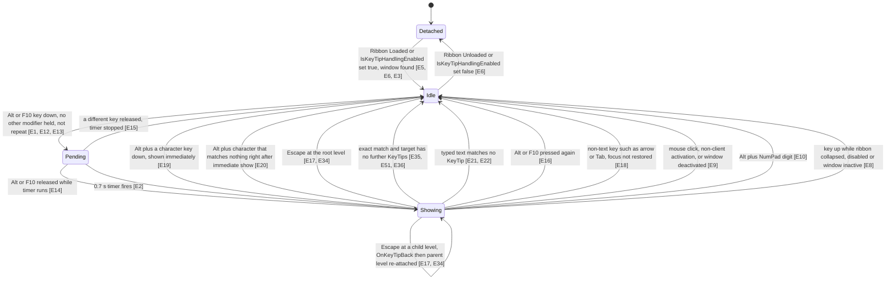
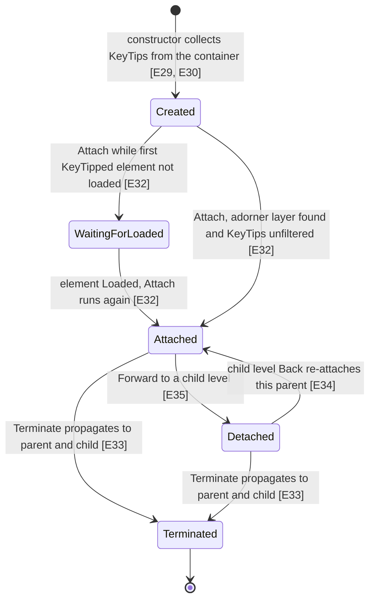

# KeyTips

KeyTips are the small letter badges that appear on ribbon tabs and buttons when you press Alt or F10. Typing the letters on a badge "presses" that control, and if the control has more KeyTips inside it (a tab, a drop-down, the Backstage), the next level of badges appears. Escape goes back one level, and clicking with the mouse, switching windows, or typing a key that matches nothing makes all KeyTips go away. When the KeyTips close, keyboard focus goes back to where it was before, unless the pressed control took focus itself.

Scope: `Fluent.Ribbon/Services/KeyTipService.cs` (when KeyTips start and stop), `Fluent.Ribbon/Adorners/KeyTipAdorner.cs` (finding, showing, placing and navigating KeyTips), `Fluent.Ribbon/Controls/KeyTip.cs` (attached properties), `Fluent.Ribbon/Data/KeyTipInformation.cs`, `Fluent.Ribbon/IKeyTipedControl.cs`, `Fluent.Ribbon/Extensibility/IKeyTipInformationProvider.cs`, `Fluent.Ribbon/Data/KeyTipPressedResult.cs`. All line numbers refer to the checked-out branch `claude/affectionate-pascal-2qipcf`.

Note on issue #357: in this checkout, `KeyTipAdorner.IsTextBoxShapedControl` does **not** contain `(element is IKeyTipedControl && element is not IRibbonControl)`. It only checks `Spinner`, `ComboBox`, `TextBox` and `CheckBox` [E41]. The `IKeyTipedControl` line exists only on other branches of this fork (`fix/issue-357-keytip-placement`, `integration/all-fixes` via commit 3a97486a, and `upstream-pr/357-keytip-placement` via commit 3b929f5b). It is not documented as current behavior here.

## State diagram

KeyTipService (one per Ribbon). "Showing" means a KeyTipAdorner chain exists and is alive. The chain can be several levels deep (ribbon, then tab, then drop-down), and "level" below means the active (deepest live) adorner.

Entering "Showing": the target is the open StartScreen, else the open Backstage, else the open ApplicationMenu, else the Ribbon [E25]. The root adorner is always created on the Ribbon [E22]; if the target is not the Ribbon, the root immediately forwards to it without clicking [E26]. Focus is backed up only if it was outside the Ribbon [E27]. On leaving "Showing", focus is restored unless the pressed control reported that it took focus [E28].

KeyTipAdorner (one per level):

## Evidence

| ID | Claim | Location | Code |
|----|-------|----------|------|
| E1 | Default activation keys are LeftAlt, RightAlt and F10. | `Fluent.Ribbon/Services/KeyTipService.cs:76` | `public static IList<Key> DefaultKeyTipKeys =>` |
| E2 | A 0.7 second DispatcherTimer (SystemIdle priority) calls OnDelayedShow. | `Fluent.Ribbon/Services/KeyTipService.cs:102` | `this.timer = new DispatcherTimer(TimeSpan.FromSeconds(0.7), DispatcherPriority.SystemIdle, this.OnDelayedShow, Dispatcher.CurrentDispatcher);` |
| E3 | Attach subscribes to the window's PreviewKeyDown (and KeyUp on the next line) and hooks the HWND message loop. | `Fluent.Ribbon/Services/KeyTipService.cs:132` | `this.window.PreviewKeyDown += this.OnWindowPreviewKeyDown;` |
| E4 | Attach marks itself attached before the design-mode and window-null checks, so a later Attach returns early even if no window was found. | `Fluent.Ribbon/Services/KeyTipService.cs:118` | `this.attached = true;` |
| E5 | Ribbon attaches the KeyTipService in its Loaded handler (and detaches in Unloaded at line 1909). | `Fluent.Ribbon/Controls/Ribbon.cs:1861` | `this.keyTipService.Attach();` |
| E6 | Changing Ribbon.IsKeyTipHandlingEnabled attaches (true) or detaches (false) the service. | `Fluent.Ribbon/Controls/Ribbon.cs:1262` | `ribbon.keyTipService?.Attach();` |
| E7 | PreviewKeyDown does nothing when IsKeyTipHandlingEnabled is false. | `Fluent.Ribbon/Services/KeyTipService.cs:210` | `if (this.ribbon.IsKeyTipHandlingEnabled == false)` |
| E8 | Key handling is skipped (KeyDown) or KeyTips are terminated (KeyUp) when the ribbon is collapsed, disabled, or the window is missing or inactive. | `Fluent.Ribbon/Services/KeyTipService.cs:358` | `if (this.ribbon.IsCollapsed` |
| E9 | WindowProc terminates a live chain on WM_NCACTIVATE, window deactivation, and client or non-client mouse button messages. | `Fluent.Ribbon/Services/KeyTipService.cs:173` | `if (message == PInvoke.WM_NCACTIVATE // mouse clicks in non client area` |
| E10 | Alt plus NumPad0-9 terminates KeyTips (#241) so numpad character entry works. | `Fluent.Ribbon/Services/KeyTipService.cs:241` | `&& e.SystemKey >= Key.NumPad0` |
| E11 | Shift+F10 is never treated as a show/hide key. | `Fluent.Ribbon/Services/KeyTipService.cs:394` | `if (realKey == Key.F10` |
| E12 | Holding any Shift/Ctrl/Alt key that is not itself a KeyTip key makes the key not a show/hide key. | `Fluent.Ribbon/Services/KeyTipService.cs:408` | `var blacklistedModifierKeys = modifierKeys.Except(this.KeyTipKeys);` |
| E13 | Show/hide key down with no visible KeyTips calls ShowDelayed, which terminates any chain and starts the timer (lines 467-469). | `Fluent.Ribbon/Services/KeyTipService.cs:254` | `this.ShowDelayed();` |
| E14 | Show/hide key up while the timer is running shows KeyTips immediately. | `Fluent.Ribbon/Services/KeyTipService.cs:371` | `if (this.timer.IsEnabled)` |
| E15 | Any other key up stops the timer. | `Fluent.Ribbon/Services/KeyTipService.cs:383` | `this.timer.Stop();` |
| E16 | Show/hide key down while KeyTips are visible terminates them. | `Fluent.Ribbon/Services/KeyTipService.cs:258` | `this.Terminate();` |
| E17 | Escape (without Alt) while a chain exists calls Back on the active level and marks the key handled. | `Fluent.Ribbon/Services/KeyTipService.cs:264` | `this.activeAdornerChain.ActiveKeyTipAdorner.Back();` |
| E18 | A key with no text (empty or tab) drops the focus backup and terminates. | `Fluent.Ribbon/Services/KeyTipService.cs:290` | `this.backUpFocusedControl = null;` |
| E19 | A character key with Alt held and no visible KeyTips shows KeyTips immediately and processes the key. | `Fluent.Ribbon/Services/KeyTipService.cs:304` | `this.ShowImmediatly();` |
| E20 | If that immediate key matches nothing, KeyTips terminate and the key is not handled (access keys, #258). | `Fluent.Ribbon/Services/KeyTipService.cs:319` | `if (shownImmediately)` |
| E21 | On a non-matching key, terminate if the chain's AdornedElement is a Ribbon (#908); otherwise revert input and beep. | `Fluent.Ribbon/Services/KeyTipService.cs:326` | `if (this.activeAdornerChain.AdornedElement is Ribbon)` |
| E22 | The root adorner is always created with the Ribbon as adorned element and container. | `Fluent.Ribbon/Services/KeyTipService.cs:528` | `this.activeAdornerChain = new KeyTipAdorner(this.ribbon, this.ribbon, null);` |
| E23 | An exact match on the active level forwards with click=true and clears input. | `Fluent.Ribbon/Services/KeyTipService.cs:339` | `if (this.activeAdornerChain.ActiveKeyTipAdorner.Forward(this.currentUserInput, true))` |
| E24 | A prefix match filters the active level's KeyTips. | `Fluent.Ribbon/Services/KeyTipService.cs:346` | `this.activeAdornerChain.ActiveKeyTipAdorner.FilterKeyTips(this.currentUserInput);` |
| E25 | KeyTip target priority is StartScreen, then Backstage, then ApplicationMenu, then Ribbon (each only when open). | `Fluent.Ribbon/Services/KeyTipService.cs:493` | `var keyTipsTarget = this.GetStartScreen()` |
| E26 | If the target is not the Ribbon, the root adorner forwards to it without clicking. | `Fluent.Ribbon/Services/KeyTipService.cs:535` | `this.activeAdornerChain.Forward(string.Empty, keyTipsTarget, false);` |
| E27 | Focus is backed up only when it is not already inside the Ribbon; then the selected tab item is focused (line 517). | `Fluent.Ribbon/Services/KeyTipService.cs:508` | `if (UIHelper.GetParent<Ribbon>(Keyboard.FocusedElement as DependencyObject) is null)` |
| E28 | On chain termination, focus is restored unless the pressed element acquired focus; popups are closed unless it opened one (line 439). | `Fluent.Ribbon/Services/KeyTipService.cs:444` | `if (e.PressedElementAquiredFocus == false)` |
| E29 | An element gets a KeyTip from the KeyTip.Keys attached property. | `Fluent.Ribbon/Adorners/KeyTipAdorner.cs:120` | `var keys = KeyTip.GetKeys(child);` |
| E30 | After a KeyTipped element (not a RibbonGroupBox) is found, its descendants are not searched on this level. | `Fluent.Ribbon/Adorners/KeyTipAdorner.cs:130` | `// Do not search deeper in the tree` |
| E31 | A RibbonGroupBox KeyTip is hidden unless the group box is collapsed; its children are still searched. | `Fluent.Ribbon/Adorners/KeyTipAdorner.cs:146` | `var keyTipInformation = new KeyTipInformation(keys, child, hide` |
| E32 | Attach waits for the Loaded event if the first KeyTipped element is not loaded. | `Fluent.Ribbon/Adorners/KeyTipAdorner.cs:243` | `this.oneOfAssociatedElements.Loaded += this.OnDelayAttach;` |
| E33 | Terminate detaches, then terminates the parent and child, then raises Terminated. | `Fluent.Ribbon/Adorners/KeyTipAdorner.cs:317` | `this.parentAdorner?.Terminate(keyTipPressedResult);` |
| E34 | Back calls OnKeyTipBack on the container, then detaches and re-attaches the parent; with no parent it terminates (line 390). | `Fluent.Ribbon/Adorners/KeyTipAdorner.cs:386` | `this.parentAdorner.Attach();` |
| E35 | Forward detaches the current level and, when clicking, calls IKeyTipedControl.OnKeyTipPressed. | `Fluent.Ribbon/Adorners/KeyTipAdorner.cs:433` | `keyTipPressedResult = control?.OnKeyTipPressed() ?? KeyTipPressedResult.Empty;` |
| E36 | If the new child level has no KeyTips, the chain terminates with the pressed result. | `Fluent.Ribbon/Adorners/KeyTipAdorner.cs:451` | `if (this.childAdorner.keyTipInformations.Any() == false)` |
| E37 | An exact match needs an enabled, visible KeyTip; comparison ignores case. | `Fluent.Ribbon/Adorners/KeyTipAdorner.cs:467` | `return this.keyTipInformations.FirstOrDefault(x => x.IsEnabled && x.Visibility == Visibility.Visible && keys.Equals(x.Keys, StringComparison.OrdinalIgnoreCase));` |
| E38 | Quick Access Toolbar placement is checked first; there AutoPlacement=false only applies HorizontalAlignment Left/Right. | `Fluent.Ribbon/Adorners/KeyTipAdorner.cs:624` | `if (IsWithinQuickAccessToolbar(keyTipInformation.AssociatedElement))` |
| E39 | Outside the QAT and dialog launcher, AutoPlacement=false uses KeyTip.HorizontalAlignment/VerticalAlignment relative to the element. | `Fluent.Ribbon/Adorners/KeyTipAdorner.cs:659` | `else if (KeyTip.GetAutoPlacement(keyTipInformation.AssociatedElement) == false)` |
| E40 | In the fallback branch, non-Large controls and text-box-shaped controls get top-left style placement; Large ones get bottom-center. | `Fluent.Ribbon/Adorners/KeyTipAdorner.cs:743` | `if (RibbonProperties.GetSize(keyTipInformation.AssociatedElement) != RibbonControlSize.Large` |
| E41 | IsTextBoxShapedControl checks only Spinner, ComboBox, TextBox and CheckBox in this checkout (no IKeyTipedControl clause). | `Fluent.Ribbon/Adorners/KeyTipAdorner.cs:774` | `return element is Spinner` |
| E42 | SnapToRowsIfPresent takes the Point by value. | `Fluent.Ribbon/Adorners/KeyTipAdorner.cs:803` | `private static void SnapToRowsIfPresent(double[]? rows, KeyTipInformation keyTipInformation, Point translatedPoint)` |
| E43 | The only write in SnapToRowsIfPresent is to the local copy's Y. | `Fluent.Ribbon/Adorners/KeyTipAdorner.cs:829` | `translatedPoint.Y = rows[index] - (keyTipInformation.KeyTip.DesiredSize.Height / 2.0);` |
| E44 | KeyTip.Keys is a string attached property. | `Fluent.Ribbon/Controls/KeyTip.cs:21` | `DependencyProperty.RegisterAttached("Keys", typeof(string), typeof(KeyTip), new PropertyMetadata(OnKeysChanged));` |
| E45 | KeyTip.AutoPlacement defaults to true. | `Fluent.Ribbon/Controls/KeyTip.cs:59` | `DependencyProperty.RegisterAttached("AutoPlacement", typeof(bool), typeof(KeyTip), new PropertyMetadata(BooleanBoxes.TrueBox));` |
| E46 | Each KeyTip's IsEnabled is bound one-way to its element's IsEnabled. | `Fluent.Ribbon/Data/KeyTipInformation.cs:52` | `this.KeyTip.SetBinding(UIElement.IsEnabledProperty, binding);` |
| E47 | KeyTipPressedResult carries two flags: focus acquired and popup opened. | `Fluent.Ribbon/Data/KeyTipPressedResult.cs:25` | `public KeyTipPressedResult(bool pressedElementAquiredFocus, bool pressedElementOpenedPopup)` |
| E48 | IKeyTipedControl requires OnKeyTipPressed returning a KeyTipPressedResult (plus OnKeyTipBack and a KeyTip string). | `Fluent.Ribbon/IKeyTipedControl.cs:16` | `KeyTipPressedResult OnKeyTipPressed();` |
| E49 | IKeyTipInformationProvider lets an element supply its own KeyTipInformation list. | `Fluent.Ribbon/Extensibility/IKeyTipInformationProvider.cs:15` | `IEnumerable<KeyTipInformation> GetKeyTipInformations(bool hide);` |
| E50 | RibbonControl.KeyTip is the same property as KeyTip.Keys (AddOwner). | `Fluent.Ribbon/Controls/RibbonControl.cs:44` | `public static readonly DependencyProperty KeyTipProperty = Fluent.KeyTip.KeysProperty.AddOwner(typeof(RibbonControl));` |
| E51 | Forward terminates when the pressed element has no visible children. | `Fluent.Ribbon/Adorners/KeyTipAdorner.cs:438` | `if (children.Count == 0)` |
| E52 | Show unsubscribes from an existing chain but does not terminate it before creating a new one. | `Fluent.Ribbon/Services/KeyTipService.cs:524` | `this.activeAdornerChain.Terminated -= this.OnAdornerChainTerminated;` |
| E53 | Detach returns before removing the delayed-attach Loaded handler when the adorner is not yet attached. | `Fluent.Ribbon/Adorners/KeyTipAdorner.cs:281` | `if (!this.attached)` |
| E54 | Ribbon.KeyTipKeys changes replace the service's key list entirely. | `Fluent.Ribbon/Controls/Ribbon.cs:1289` | `this.keyTipService.KeyTipKeys.Clear();` |
| E55 | IsAdornerChainAlive is true while attaching, attached, or any child is alive. | `Fluent.Ribbon/Adorners/KeyTipAdorner.cs:63` | `public bool IsAdornerChainAlive => this.isAttaching` |
| E56 | A child adorner is placed on the first non-Panel child when that child lives in a different visual root (for example a popup). | `Fluent.Ribbon/Adorners/KeyTipAdorner.cs:446` | `this.childAdorner = ReferenceEquals(GetTopLevelElement(validChild), GetTopLevelElement(element)) == false` |
| E57 | DropDownButton opens its drop-down and reports focus and popup as taken. | `Fluent.Ribbon/Controls/DropDownButton.cs:706` | `return new KeyTipPressedResult(true, true);` |

## Invariants

- The root adorner is always on the Ribbon [E22]. Code that checks `activeAdornerChain.AdornedElement` sees the Ribbon no matter which level is active [E21]. Per-level checks must use `ActiveKeyTipAdorner` [E17, E23, E24].
- A level only finds KeyTips on direct KeyTipped elements; it does not look inside them, except inside RibbonGroupBox [E30, E31]. Nested KeyTips appear only after the parent is pressed and `Forward` builds a child level [E35, E56].
- A KeyTip counts for matching only while its element is enabled (through the IsEnabled binding) [E37, E46]. Prefix checks use enabled KeyTips only (KeyTipAdorner.cs:476).
- Focus restore depends on `KeyTipPressedResult`. A control that takes focus or opens a popup must return a result that says so, or focus is moved back and popups are closed [E28, E47, E57].
- Termination has to reach the root, because only the root's `Terminated` event is subscribed by the service [E33, E22]. `Terminate` walks both up and down the chain [E33].
- `IsAdornerChainAlive` includes the "attaching" state [E55]. The service's "show or hide" decision uses it [E13, E16].
- KeyTip keys from `Ribbon.KeyTipKeys` replace the defaults; they do not add to them [E54, E1].
- The service must be attached to a real Window. `attached` is set before the window lookup [E4], so if the first Attach finds no window, the service stays inert until Detach and Attach run again (Unloaded/Loaded or toggling IsKeyTipHandlingEnabled) [E5, E6].

## How app code should interact

- **Give a control a KeyTip:** set the `KeyTip.Keys` attached property (`Fluent:KeyTip.Keys="H"`) [E44, E29]. On Fluent controls, the `KeyTip` property is the same dependency property [E50].
- **Make the KeyTip do something:** implement `IKeyTipedControl`. `OnKeyTipPressed` runs when the keys match exactly [E35, E48]. Return `KeyTipPressedResult.Empty` for a plain action, or `new KeyTipPressedResult(true, true)` (or other flags) if the control took focus or opened a popup [E47, E57, E28]. `OnKeyTipBack` runs when the user presses Escape at the level built from your control [E34]. A control that only has `KeyTip.Keys` and does not implement `IKeyTipedControl` still shows a KeyTip, but pressing it does nothing except navigate into its visible children [E35, E51].
- **Supply several KeyTips from one control:** implement `Fluent.Extensibility.IKeyTipInformationProvider` [E49]. SplitButton does this (SplitButton.cs:23).
- **Placement:** `KeyTip.AutoPlacement` defaults to true [E45]. Set it to false and use `KeyTip.HorizontalAlignment` / `KeyTip.VerticalAlignment` (both default Center, KeyTip.cs:95 and 152) to place the KeyTip relative to the element [E39]. In the Quick Access Toolbar only HorizontalAlignment Left/Right has an effect [E38]. `KeyTip.Margin` is applied to every KeyTip (KeyTipAdorner.cs:622). With auto placement, custom controls that are not Spinner/ComboBox/TextBox/CheckBox and whose `RibbonProperties.Size` is Large get bottom-center placement [E40, E41].
- **Disable:**
  - One control: leave `KeyTip.Keys` unset, or disable the control (a disabled control's KeyTip cannot be matched) [E46, E37].
  - All KeyTips for a Ribbon: set `Ribbon.IsKeyTipHandlingEnabled="False"` [E6, E7].
- **Change activation keys:** add keys to `Ribbon.KeyTipKeys`. This replaces the Alt/F10 defaults [E54, E1].

## Suspicious findings (unverified)

These are candidates found by reading the code. None has been confirmed by running it.

1. **Row snapping has no effect.**
   - Where: `Fluent.Ribbon/Adorners/KeyTipAdorner.cs:803` and `:829`, used at `:752` and `:764`.
   - Why it looks wrong: `Point` is a struct passed by value [E42]. The method only assigns `translatedPoint.Y` on its local copy [E43], and callers then use their own unchanged `translatedPoint` (line 754). KeyTips are never snapped to group rows.
   - Test: in a RibbonGroupBox, log `keyTipInformation.Position.Y` after `UpdateKeyTipPositions` with and without the call, or change the parameter to `ref` and compare screenshots.
2. **The "beep and keep previous input" path looks unreachable.**
   - Where: `Fluent.Ribbon/Services/KeyTipService.cs:326` versus `:528`.
   - Why it looks wrong: `activeAdornerChain` is always the root adorner, which always adorns the Ribbon [E22]. So `AdornedElement is Ribbon` is always true [E21], and a wrong key at any level (for example inside an open drop-down) terminates all KeyTips. Lines 333-336 never run. The #908 comment suggests only the first level was meant; `ActiveKeyTipAdorner.AdornedElement` may have been intended.
   - Test: press Alt, open a tab with its KeyTip, press a letter that matches nothing on that tab. Expected by the comment: beep and stay. Predicted by the code: KeyTips close.
3. **A pending delayed attach cannot be cancelled.**
   - Where: `Fluent.Ribbon/Adorners/KeyTipAdorner.cs:281` and `:289`.
   - Why it looks wrong: `Detach` returns while `attached` is false [E53], so the `Loaded -= OnDelayAttach` on line 289 never runs for an adorner that is waiting for Loaded [E32]. Its `isAttaching` stays true, so `IsAdornerChainAlive` stays true [E55]. If the element loads later, a terminated adorner could attach and show KeyTips.
   - Test: give KeyTips to elements in a tab whose content is not yet loaded, press the tab KeyTip, and press Escape before the content loads. Check whether KeyTips appear afterwards.
4. **Show replaces an old chain without terminating it.**
   - Where: `Fluent.Ribbon/Services/KeyTipService.cs:522-528`.
   - Why it looks wrong: an existing chain is only unsubscribed [E52]. `ShowImmediatly` can run when the chain exists but has no visible KeyTips (line 300-304). If that chain is still in an adorner layer, it would stay there.
   - Test: reach a state where `AreAnyKeyTipsVisible` is false but the chain is alive (for example all KeyTips filtered or collapsed), press Alt plus a letter, and inspect the adorner layer for two KeyTipAdorners.
5. **Service can stay inert after an early Attach.**
   - Where: `Fluent.Ribbon/Services/KeyTipService.cs:118-130`.
   - Why it looks wrong: `attached = true` is set before `Window.GetWindow` [E4]. If the Ribbon loads before it has a Window (hosted in a non-Window root), no handlers are added, and later Attach calls return early.
   - Test: host a Ribbon where `Window.GetWindow` returns null at Loaded, then move it into a Window without an Unload, and press Alt.
6. **Turning off IsKeyTipHandlingEnabled while KeyTips are shown leaves them on screen.**
   - Where: `Fluent.Ribbon/Services/KeyTipService.cs:143-165`.
   - Why it looks wrong: `Detach` stops the timer and unhooks events but never terminates `activeAdornerChain`. With the hook removed, clicks no longer dismiss the KeyTips.
   - Test: show KeyTips, set `IsKeyTipHandlingEnabled=false` from a timer, then click.
7. **Minor:** `if (keyTipsTarget is null)` at `KeyTipService.cs:498` can never be true, because the expression ends with `?? this.ribbon`. It is dead code, not a behavior bug.

## Open questions

- The code does not explain why the root adorner is always created on the Ribbon even when the target is the Backstage or StartScreen (the comment at KeyTipService.cs:527 only says "to mimik the Office behavior"). The visual effect of that root level before it forwards could not be determined from the code.
- `Backstage.OnKeyTipPressed` opens the Backstage but returns `KeyTipPressedResult.Empty` (Backstage.cs:748-753). So when the chain ends right there, the code calls ClosePopups and RestoreFocus [E28]. Whether PopupService dismissal actually affects an open Backstage depends on code outside this area (PopupService, Backstage) and was not checked.
- The #357 fix exists on branches `fix/issue-357-keytip-placement`, `integration/all-fixes` and `upstream-pr/357-keytip-placement`, but not on this checkout [E41]. Which branch the published docs should describe is a project decision the code cannot answer.
- Whether the KeyTip visual style in `Fluent.Ribbon/Themes/` changes size or offsets (which would affect the placement math) was not examined.
- The `ScopeGuard` re-entrancy beep (KeyTipService.cs:215-218) implies PreviewKeyDown can re-enter itself (for example from `OnKeyTipPressed` opening a dialog). No caller that triggers this was found.
