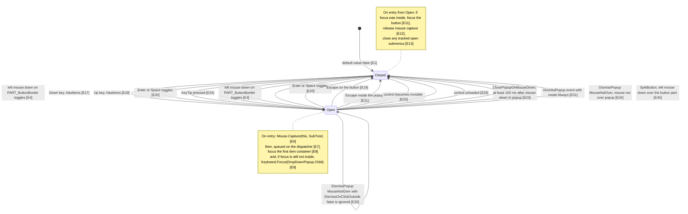
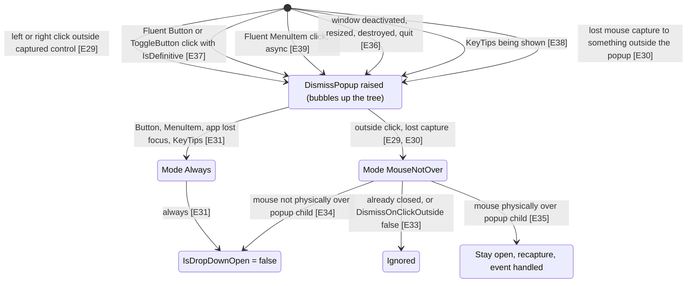

# Drop downs and popups

A drop down button is a ribbon button that shows a list (a "popup") under itself when you click it. The list opens when you click the button, press Down, Up, Enter or Space on it, or use its KeyTip. It closes when you press Escape, click the button again, click outside the list, click a command inside it, switch to another window, or bring up KeyTips. A split button is the same thing with two halves: one half runs a command, the other half opens the list.

This note covers `DropDownButton`, `SplitButton`, the `IDropDownControl` interface and `PopupService` as they are in this checkout. `FocusFirstItemOnDropDownOpen` (fork change for issue #813) is **not** in this checkout: a search for `FocusFirstItem` in `*.cs` and `*.xaml` finds nothing. It exists only on the separate branch `feature/issue-813-focus-first-item`, which this note does not describe.

## State diagram

`IsDropDownOpen` is a dependency property with a change callback [E1]. The template binds `Popup.IsOpen` to it [E2], so "Open" below means `IsDropDownOpen == true`. Every transition sets `IsDropDownOpen`, and the change callback does the work on entry and exit (see the notes).

Where DismissPopup events come from, and what the class handler does with them:

## Evidence

| ID | Claim | Location | Code |
| --- | --- | --- | --- |
| E1 | `IsDropDownOpen` is a DependencyProperty, default false, with change callback `OnIsDropDownOpenChanged`. | `Fluent.Ribbon/Controls/DropDownButton.cs:242` | `new PropertyMetadata(BooleanBoxes.FalseBox, OnIsDropDownOpenChanged));` |
| E2 | The default template binds the popup's `IsOpen` to `IsDropDownOpen`. | `Fluent.Ribbon/Themes/Controls/DropDownButton.xaml:136` | `IsOpen="{TemplateBinding IsDropDownOpen}"` |
| E3 | The CLR setter of `IsDropDownOpen` uses `SetValue` (not `SetCurrentValue`). | `Fluent.Ribbon/Controls/DropDownButton.cs:236` | `set => this.SetValue(IsDropDownOpenProperty, BooleanBoxes.Box(value));` |
| E4 | Left mouse down on `PART_ButtonBorder` marks the event handled, focuses the button and toggles `IsDropDownOpen`. | `Fluent.Ribbon/Controls/DropDownButton.cs:602` | `this.IsDropDownOpen = !this.IsDropDownOpen;` |
| E5 | That handler is attached to `PART_ButtonBorder` with a plain `+=` (so it does not run for mouse downs already marked handled). | `Fluent.Ribbon/Controls/DropDownButton.cs:445` | `this.buttonBorder.MouseLeftButtonDown += this.HandleButtonBorderMouseLeftButtonDown;` |
| E6 | On open, the button captures the mouse for its whole subtree. | `Fluent.Ribbon/Controls/DropDownButton.cs:744` | `Mouse.Capture(this, CaptureMode.SubTree);` |
| E7 | On open, focus handling is queued on the dispatcher (async, `DispatcherPriority.Normal` by default), not done immediately. | `Fluent.Ribbon/Controls/DropDownButton.cs:748` | `this.RunInDispatcherAsync(` |
| E8 | The queued code gets the container of item 0 and passes it to `NavigateToContainer`. | `Fluent.Ribbon/Controls/DropDownButton.cs:751` | `var container = this.ItemContainerGenerator.ContainerFromIndex(0);` |
| E9 | If keyboard focus is still not inside the button, it calls `Keyboard.Focus(DropDownPopup.Child)` ("whole dropdown content is disabled" edge case). | `Fluent.Ribbon/Controls/DropDownButton.cs:758` | `Keyboard.Focus(this.DropDownPopup.Child);` |
| E10 | `NavigateToContainer` calls `Keyboard.Focus` if the element is focusable, otherwise `MoveFocus` in the given direction; it returns early if the container is not a `UIElement` (including null). | `Fluent.Ribbon/Controls/DropDownButton.cs:686` | `element.MoveFocus(new TraversalRequest(focusNavigationDirection));` |
| E11 | On close, if focus is inside the button's subtree, the button takes focus. | `Fluent.Ribbon/Controls/DropDownButton.cs:768` | `if (this.IsKeyboardFocusWithin)` |
| E12 | On close, mouse capture is released unconditionally. | `Fluent.Ribbon/Controls/DropDownButton.cs:774` | `Mouse.Capture(null);` |
| E13 | On close, every still-alive tracked submenu that is open gets `IsSubmenuOpen = false`, then the list is cleared and `DropDownClosed` fires. | `Fluent.Ribbon/Controls/DropDownButton.cs:803` | `menuItem.IsSubmenuOpen = false;` |
| E14 | Submenus are tracked by listening to `MenuItem.SubmenuOpenedEvent` and pushing a weak reference to the original source. | `Fluent.Ribbon/Controls/DropDownButton.cs:922` | `this.openMenuItems.Push(new WeakReference(menuItem));` |
| E15 | `DropDownOpened` is raised from `OnDropDownOpened`, which runs after capture is taken and focus work is queued. | `Fluent.Ribbon/Controls/DropDownButton.cs:785` | `this.DropDownOpened?.Invoke(this, EventArgs.Empty);` |
| E16 | On open, `MaxDropDownHeight` is re-coerced. When it is NaN, the helper returns one third of the screen working area height. | `Fluent.Ribbon/Helpers/DropDownHelper.cs:39` | `return Math.Floor(workingAreaHeight / 3D);` |
| E17 | `OnKeyDown`: Down opens the drop down only if it has items and is closed, then navigates to container 0. | `Fluent.Ribbon/Controls/DropDownButton.cs:617` | `case Key.Down:` |
| E18 | `OnKeyDown`: Up opens the drop down only if it has items and is closed, then navigates to the last container, direction Up. | `Fluent.Ribbon/Controls/DropDownButton.cs:638` | `var container = this.ItemContainerGenerator.ContainerFromIndex(this.Items.Count - 1);` |
| E19 | `OnKeyDown`: Escape closes only if open. | `Fluent.Ribbon/Controls/DropDownButton.cs:648` | `if (this.IsDropDownOpen)` |
| E20 | `OnKeyDown`: Enter and Space always toggle `IsDropDownOpen` and mark the event handled (no `HasItems` check). | `Fluent.Ribbon/Controls/DropDownButton.cs:658` | `this.IsDropDownOpen = !this.IsDropDownOpen;` |
| E21 | A KeyDown handler on the Popup itself closes on Escape. | `Fluent.Ribbon/Controls/DropDownButton.cs:567` | `this.IsDropDownOpen = false;` |
| E22 | The popup's MouseDown handler is registered with handledEventsToo = true. | `Fluent.Ribbon/Controls/DropDownButton.cs:451` | `this.DropDownPopup.AddHandler(MouseDownEvent, new RoutedEventHandler(this.OnDropDownPopupMouseDown), true);` |
| E23 | With `ClosePopupOnMouseDown` and the mouse not over the resize thumbs, a background task waits max(100, `ClosePopupOnMouseDownDelay`) ms, then closes via the dispatcher. | `Fluent.Ribbon/Controls/DropDownButton.cs:590` | `await Task.Delay(Math.Max(100, timespan));` |
| E24 | `OnKeyTipPressed` opens the drop down and returns a result saying it opened a popup. | `Fluent.Ribbon/Controls/DropDownButton.cs:704` | `this.IsDropDownOpen = true;` |
| E25 | When `IsVisible` becomes false, `IsDropDownOpen` is set to false with `SetCurrentValue`. | `Fluent.Ribbon/Controls/DropDownButton.cs:422` | `this.SetCurrentValue(IsDropDownOpenProperty, BooleanBoxes.FalseBox);` |
| E26 | On `Unloaded`, `IsDropDownOpen` is set to false with `SetCurrentValue`, then event handlers are removed. | `Fluent.Ribbon/Controls/DropDownButton.cs:433` | `this.SetCurrentValue(IsDropDownOpenProperty, false);` |
| E27 | `DropDownButton` (and so `SplitButton`) registers the `PopupService` class handlers in its static constructor. | `Fluent.Ribbon/Controls/DropDownButton.cs:398` | `PopupService.Attach(type);` |
| E28 | `DismissPopupEvent` is a bubbling routed event. | `Fluent.Ribbon/Services/PopupService.cs:111` | `EventManager.RegisterRoutedEvent("DismissPopup", RoutingStrategy.Bubble` |
| E29 | `Attach` registers a class handler for `Mouse.PreviewMouseDownOutsideCapturedElementEvent`. For left or right button, when the sender holds capture (or is an `IDropDownControl` while a PopupRoot holds it), it raises DismissPopup (MouseNotOver for non-ribbon controls). | `Fluent.Ribbon/Services/PopupService.cs:195` | `RaiseDismissPopupEvent(sender, DismissPopupMode.MouseNotOver);` |
| E30 | `OnLostMouseCapture`: if neither popup-contains-sender, sender-contains-popup, nor popup-contains-original-source holds, it raises DismissPopup MouseNotOver. | `Fluent.Ribbon/Services/PopupService.cs:249` | `if (IsAncestorOf(popup, sender as DependencyObject) == false` |
| E31 | DismissPopup with mode Always sets `IsDropDownOpen = false` with no further checks and does not mark the event handled. | `Fluent.Ribbon/Services/PopupService.cs:335` | `control.IsDropDownOpen = false;` |
| E32 | `OnLostMouseCapture` does nothing if the sender still has capture, the drop down is closed, or its context menu is open. | `Fluent.Ribbon/Services/PopupService.cs:219` | `control.IsDropDownOpen == false` |
| E33 | Mode MouseNotOver returns early if the drop down is closed or it is a `DropDownButton` with `DismissOnClickOutside == false`. | `Fluent.Ribbon/Services/PopupService.cs:341` | `control is DropDownButton { DismissOnClickOutside: false })` |
| E34 | Mode MouseNotOver closes the drop down if the mouse is not physically over the popup child (bounds check on `RenderSize`). | `Fluent.Ribbon/Services/PopupService.cs:362` | `if (IsMousePhysicallyOver(control.DropDownPopup) == false)` |
| E35 | Otherwise it re-takes SubTree capture if needed and marks the event handled, which stops it bubbling to parent drop downs. | `Fluent.Ribbon/Services/PopupService.cs:373` | `e.Handled = true;` |
| E36 | `KeyTipService` raises DismissPopup Always with reason `ApplicationLostFocus` on the ribbon, `Mouse.Captured` and `Keyboard.FocusedElement` for WM_ACTIVATE (deactivate), WM_SIZE, WM_DESTROY and WM_QUIT. | `Fluent.Ribbon/Services/KeyTipService.cs:189` | `PopupService.RaiseDismissPopupEvent(Mouse.Captured, DismissPopupMode.Always, DismissPopupReason.ApplicationLostFocus);` |
| E37 | Fluent `Button.OnClick` raises DismissPopup Always from itself when `IsDefinitive` is true (`ToggleButton.OnClick` does the same at line 247). | `Fluent.Ribbon/Controls/Button.cs:232` | `PopupService.RaiseDismissPopupEvent(this, DismissPopupMode.Always);` |
| E38 | Showing KeyTips raises DismissPopup Always with reason `ShowingKeyTips` from the focused element. | `Fluent.Ribbon/Services/KeyTipService.cs:420` | `PopupService.RaiseDismissPopupEvent(Keyboard.FocusedElement, DismissPopupMode.Always, DismissPopupReason.ShowingKeyTips);` |
| E39 | Fluent `MenuItem.OnClick` raises DismissPopup Always asynchronously when `IsDefinitive` and it has no items or is split. | `Fluent.Ribbon/Controls/MenuItem.cs:569` | `PopupService.RaiseDismissPopupEventAsync(this, DismissPopupMode.Always);` |
| E40 | `SplitButton.OnPreviewMouseLeftButtonDown`: if the mouse is over the inner button part it closes the drop down and skips the base call; otherwise it calls base. | `Fluent.Ribbon/Controls/SplitButton.cs:408` | `this.IsDropDownOpen = false;` |
| E41 | `SplitButton.OnKeyDown` calls the `DropDownButton` handler first, then on Enter also clicks the inner button. | `Fluent.Ribbon/Controls/SplitButton.cs:424` | `this.button?.InvokeClick();` |
| E42 | A click of the inner button is re-raised as `SplitButton.Click` from the SplitButton itself. | `Fluent.Ribbon/Controls/SplitButton.cs:438` | `this.RaiseEvent(new RoutedEventArgs(ClickEvent, this));` |
| E43 | `IsChecked` is coerced to false when `IsCheckable` is false. | `Fluent.Ribbon/Controls/SplitButton.cs:139` | `return BooleanBoxes.FalseBox;` |
| E44 | In the SplitButton template, `IsChecked` is bound two-way to the inner `PART_Button` ToggleButton, which sits inside `PART_ButtonBorder`. | `Fluent.Ribbon/Themes/Controls/SplitButton.xaml:95` | `IsChecked="{Binding IsChecked, Mode=TwoWay, RelativeSource={RelativeSource TemplatedParent}}"` |
| E45 | `IsButtonEnabled` drives only the inner button's `IsEnabled`. | `Fluent.Ribbon/Themes/Controls/SplitButton.xaml:97` | `IsEnabled="{Binding IsButtonEnabled, Mode=TwoWay, RelativeSource={RelativeSource TemplatedParent}}"` |
| E46 | `SplitButton.IsDefinitive` defaults to true and is passed to the inner button. | `Fluent.Ribbon/Controls/SplitButton.cs:212` | `DependencyProperty.Register(nameof(IsDefinitive), typeof(bool), typeof(SplitButton), new PropertyMetadata(BooleanBoxes.TrueBox));` |
| E47 | `DismissOnClickOutside` defaults to true. | `Fluent.Ribbon/Controls/DropDownButton.cs:127` | `DependencyProperty.Register(nameof(DismissOnClickOutside), typeof(bool), typeof(DropDownButton), new PropertyMetadata(BooleanBoxes.TrueBox));` |
| E48 | The popup child in the DropDownButton template is a `ResizeableContentControl`. | `Fluent.Ribbon/Themes/Controls/DropDownButton.xaml:139` | `<Fluent:ResizeableContentControl x:Name="PART_PopupContentControl"` |
| E49 | `ResizeableContentControl` overrides `Focusable` to false. | `Fluent.Ribbon/Controls/ResizeableContentControl.cs:26` | `FocusableProperty.OverrideMetadata(typeof(ResizeableContentControl), new FrameworkPropertyMetadata(BooleanBoxes.FalseBox));` |
| E50 | Fluent `MenuItem` implements `IDropDownControl`, mapping `IsDropDownOpen` to `IsSubmenuOpen`. | `Fluent.Ribbon/Controls/MenuItem.cs:111` | `get => this.IsSubmenuOpen;` |
| E51 | Fluent `MenuItem` does not register the `PopupService` class handlers (the call is commented out). | `Fluent.Ribbon/Controls/MenuItem.cs:223` | `//PopupService.Attach(type);` |

## Invariants

- `Popup.IsOpen` has no logic of its own. It is a TemplateBinding to `IsDropDownOpen` [E2]. Any custom template must keep that binding and keep the names `PART_Popup` and `PART_ButtonBorder`, or opening by mouse [E4, E5] and Escape inside the popup [E21] stop working.
- While open, the button must hold mouse capture (SubTree) [E6]. `PopupService` only reacts to outside clicks when the sender holds capture [E29], and it re-takes capture to stay open [E35]. Code that takes capture elsewhere while a drop down is open will trigger `OnLostMouseCapture` and can close it [E30, E32].
- Closing always calls `Mouse.Capture(null)` [E12]. It does not check who holds capture first.
- Opening focuses content asynchronously [E7]. Anything that runs synchronously after setting `IsDropDownOpen = true` (including `DropDownOpened` handlers [E15]) runs before the first item gets focus.
- Mode Always never marks the DismissPopup event handled [E31], and the event bubbles [E28]. One definitive click inside nested drop downs closes every ancestor `IDropDownControl` that registered the class handler [E27]. Mode MouseNotOver stops the bubble when the mouse is over the popup [E35].
- `DismissOnClickOutside` is only read in the MouseNotOver path [E33]. Mode Always sources (definitive clicks, app lost focus, KeyTips) close the drop down regardless [E31, E36, E37, E38].
- Fluent `MenuItem` submenus are not handled by `PopupService` [E51]. Their closing on parent close depends on `DropDownButton` tracking `SubmenuOpened` events [E14] and closing them in `OnDropDownClosed` [E13].
- Split button: only mouse downs outside the inner button reach `DropDownButton`'s handling [E40]. The inner button, not the SplitButton, holds `IsChecked` [E44] and `IsButtonEnabled` [E45].

## How app code should interact

- Open or close in code: set `IsDropDownOpen` [E1]. Subscribe to `DropDownOpened` / `DropDownClosed` to react [E15, E13]. If you bind it, use `Mode=TwoWay`; the control writes the property itself through the plain setter [E3, E4].
- Close the containing drop down from a command inside it: use Fluent `Button`, `ToggleButton` or `MenuItem` with `IsDefinitive = true` (the default for SplitButton is true [E46]). Their click raises DismissPopup Always [E37, E39]. Set `IsDefinitive = false` to keep the drop down open after the click.
- Close from arbitrary code inside the popup: `PopupService.RaiseDismissPopupEvent(element, DismissPopupMode.Always)` from an element inside the drop down, which bubbles to it [E28, E31].
- Keep the drop down open when the user clicks elsewhere: `DismissOnClickOutside = false` (default true [E47]) [E33]. It still closes on Escape, the button, and Always dismissals [E19, E21, E31].
- Close after any mouse down inside the popup: `ClosePopupOnMouseDown = true`; tune `ClosePopupOnMouseDownDelay` (minimum 100 ms is enforced) [E23].
- Limit height: set `MaxDropDownHeight`; if left NaN it becomes one third of the screen working area when the drop down opens [E16]. Resize handles: `ResizeMode` (template-bound to the `ResizeableContentControl` [E48]); mouse downs on its thumbs do not trigger `ClosePopupOnMouseDown` [E23].
- SplitButton: handle `Click` (or `Command`) for the button part [E42]; set `IsCheckable = true` before `IsChecked` means anything [E43]; `IsButtonEnabled = false` disables only the button part [E45].

## Suspicious findings (unverified)

These are candidates found by reading the code. None has been confirmed by running it.

1. **Known, confirmed from code: disabled-content fallback cannot take focus.** `Fluent.Ribbon/Controls/DropDownButton.cs:758` calls `Keyboard.Focus(this.DropDownPopup.Child)`. In both default templates that child is a `ResizeableContentControl` (`Fluent.Ribbon/Themes/Controls/DropDownButton.xaml:139`, `Fluent.Ribbon/Themes/Controls/SplitButton.xaml:123`), whose `Focusable` is forced to false (`Fluent.Ribbon/Controls/ResizeableContentControl.cs:26`). So this fallback does nothing with the default templates. Test: drop down with all items disabled, open it, check `Keyboard.FocusedElement`.
2. **Opening with Up may end on the first item, not the last.** `DropDownButton.cs:636-640` sets `IsDropDownOpen = true`, then synchronously focuses the last container. But the open callback also queues focus to container 0 (`DropDownButton.cs:748-753`), and that runs later. Also, right after opening, the containers may not exist yet, so `ContainerFromIndex` may return null and the sync step does nothing (`DropDownButton.cs:675-678`). Test: focus a closed DropDownButton with several items, press Up, check which item has keyboard focus.
3. **SplitButton Enter toggles the drop down and also clicks the button.** `SplitButton.cs:420` runs the base handler, which toggles `IsDropDownOpen` on Enter (`DropDownButton.cs:656-659`). Then `SplitButton.cs:422-424` also invokes the inner button click. With `IsDefinitive` true (default, `SplitButton.cs:212`) that click raises DismissPopup Always (`ToggleButton.cs:247`), which bubbles to the SplitButton and closes the drop down that was just opened. The queued focus from item 2 may then run on a closed popup, since the queued code does not check `IsDropDownOpen` (`DropDownButton.cs:748-760`). Test: focus a SplitButton, press Enter, watch `DropDownOpened`/`DropDownClosed`, `Click`, and final focus.
4. **`ClosePopupOnMouseDown` timer is never cancelled.** `DropDownButton.cs:587-593` starts a fire-and-forget task that sets `IsDropDownOpen = false` after the delay. If the user closes and reopens within that delay, the old task closes the new popup. Test: `ClosePopupOnMouseDownDelay = 2000`, click in the popup, close and reopen within 2 s.
5. **Internal code uses `SetValue`, which can replace an app binding.** The mouse, keyboard, KeyTip and `PopupService` paths assign the CLR property (`DropDownButton.cs:602`, `:621`, `:658`, `:704`; `PopupService.cs:335`, `:364`), and the setter calls `SetValue` (`DropDownButton.cs:236`). A OneWay binding on `IsDropDownOpen` would be removed on the first user open or close. `OnIsVisibleChanged` and `OnUnloaded` use `SetCurrentValue` instead (`DropDownButton.cs:422`, `:433`), so the code is inconsistent. Test: bind `IsDropDownOpen` OneWay to a view model, click the button, then change the view model value.
6. **`DismissOnClickOutside = false` leaves capture in place with no recapture logic.** `PopupService.cs:340-344` returns without touching capture or `e.Handled`. Whether the rest of the window still gets clicks while such a drop down is open depends on WPF capture routing, which this code does not show. Test: open a drop down with `DismissOnClickOutside = false`, click another ribbon button or a text box in the window, see whether it responds.
7. **Submenu stack pops without checking which submenu closed.** `DropDownButton.cs:926-931` pops the top entry for any `SubmenuClosed`, whatever its source. If submenus close in a different order than they opened, the stack can hold the wrong references. Impact looks small because `OnDropDownClosed` checks `IsSubmenuOpen` before closing each one (`DropDownButton.cs:801`). Test: nested submenus, close an inner one via code while another is open, then close the drop down.

## Open questions

- `FocusFirstItemOnDropDownOpen` (#813) is not in this checkout. How it changes the open-time focus code (E7 to E9) is not covered here.
- Whether the inner `PART_Button` of a SplitButton marks `MouseLeftButtonDown` handled (which would keep `HandleButtonBorderMouseLeftButtonDown` from running, see E5) depends on WPF `ButtonBase` behavior, which is not in this repository. The code only shows that `SplitButton.OnPreviewMouseLeftButtonDown` skips base handling over the button part [E40].
- `OnClickThroughThunk` and `DismisPopupForMouseNotOver` have special paths for a minimized `RibbonTabControl` and for "unknown popups" such as a DatePicker (`PopupService.cs:177-192`, `:347-360`). Their full effect on drop downs inside the minimized ribbon popup was not traced.
- `RibbonGroupBox`, `InRibbonGallery`, `ComboBox` and `RibbonTabControl` also call `PopupService.Attach` (`RibbonGroupBox.cs:702`, `InRibbonGallery.cs:1074`, `ComboBox.cs:376`, `RibbonTabControl.cs:433`). Their own open and close logic was not reviewed.
- Fluent `MenuItem` submenu opening and closing (`MenuItem.cs` around lines 490-530 and 620-710, including `CloseParentDropDownOrMenuItem`) was only partly read. It uses the standard WPF `IsSubmenuOpen`, not `PopupService` [E50, E51].
- The layout of the resize thumbs inside `ResizeableContentControl`'s template was not checked.
