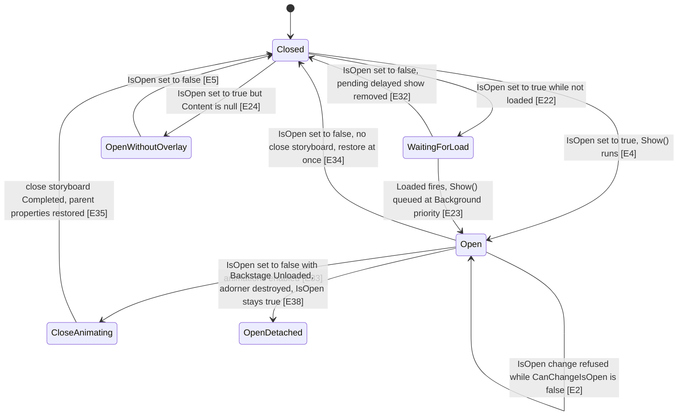
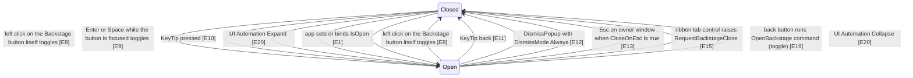
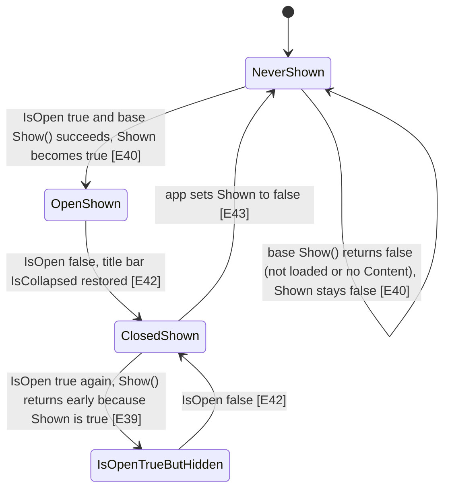

# Backstage and start screen

The Backstage is the full-window "File" view that covers the ribbon and the window content when you click the File button. The start screen is a special Backstage that is meant to be shown once, when the application starts, and that also hides the window title bar while it is open. Both are drawn as an overlay (an "adorner") on top of the window instead of being part of the normal layout. Opening or closing either one is controlled by a single on/off switch called `IsOpen`.

Scope: this describes the checkout at branch `claude/affectionate-pascal-2qipcf`. The cancelable `Closing` event for issue #1247 is NOT in this checkout (it exists only on branch `upstream-pr/1247-backstage-closing`), so it is not described here.

## State diagram

Backstage (also applies to StartScreen, see the second diagram for its extra rule). "Open" means `IsOpen` is true and the adorner is visible.

What sets `IsOpen` (every caller of `SetIsOpen` plus the public setter):

StartScreen extra rule (the `Shown` flag):

## Evidence

| ID | Claim | Location | Code |
|----|-------|----------|------|
| E1 | `IsOpen` is a public dependency property, default false, with a change callback and a coerce callback. | `Fluent.Ribbon/Controls/Backstage.cs:58` | `new PropertyMetadata(BooleanBoxes.FalseBox, OnIsOpenChanged, CoerceIsOpen)` |
| E2 | When `CanChangeIsOpen` is false, coercion returns the current `IsOpen`, so the value does not change. | `Fluent.Ribbon/Controls/Backstage.cs:66` | `return BooleanBoxes.Box(backstage.IsOpen);` |
| E3 | `CanChangeIsOpen` defaults to true. | `Fluent.Ribbon/Controls/Backstage.cs:115` | `DependencyProperty.Register(nameof(CanChangeIsOpen), typeof(bool), typeof(Backstage), new PropertyMetadata(BooleanBoxes.TrueBox));` |
| E4 | When `IsOpen` becomes true, `Show()` is called. | `Fluent.Ribbon/Controls/Backstage.cs:83` | `control.Show();` |
| E5 | When `IsOpen` becomes false, `Hide()` is called. | `Fluent.Ribbon/Controls/Backstage.cs:87` | `control.Hide();` |
| E6 | `IsOpenChanged` is raised after Show/Hide, inside a static lock. | `Fluent.Ribbon/Controls/Backstage.cs:91` | `control.IsOpenChanged?.Invoke(control, e);` |
| E7 | Internal callers change `IsOpen` through `SetIsOpen`, which uses `SetCurrentValue` (keeps app bindings). | `Fluent.Ribbon/Controls/Backstage.cs:99` | `this.SetCurrentValue(IsOpenProperty, BooleanBoxes.Box(isOpen));` |
| E8 | Mouse left button down only toggles when the event source is the Backstage itself; `Click()` toggles `IsOpen`. | `Fluent.Ribbon/Controls/Backstage.cs:739` | `if (ReferenceEquals(e.Source, this) == false)` |
| E9 | Enter or Space toggles `IsOpen` when the Backstage has focus. | `Fluent.Ribbon/Controls/Backstage.cs:688` | `if (e.Key == Key.Enter` |
| E10 | Pressing the Backstage KeyTip opens it. | `Fluent.Ribbon/Controls/Backstage.cs:750` | `this.SetIsOpen(true);` |
| E11 | KeyTip "back" closes it. | `Fluent.Ribbon/Controls/Backstage.cs:759` | `this.SetIsOpen(false);` |
| E12 | DismissPopup closes the Backstage only when DismissMode is Always (and not for ApplicationLostFocus or ShowingKeyTips, lines 277-278). | `Fluent.Ribbon/Controls/Backstage.cs:285` | `if (e.DismissMode != DismissPopupMode.Always)` |
| E13 | Esc on the owner window closes it unless `CloseOnEsc` is false; the handler is attached to the window's KeyDown in `Show()` (line 375). | `Fluent.Ribbon/Controls/Backstage.cs:704` | `if (this.CloseOnEsc == false` |
| E14 | `Show()` subscribes to the ribbon tab control's `RequestBackstageClose`; the handler calls `SetIsOpen(false)` (line 654). | `Fluent.Ribbon/Controls/Backstage.cs:351` | `this.parentRibbon.TabControl.RequestBackstageClose += this.HandleTabControlRequestBackstageClose;` |
| E15 | Clicking a visible ribbon tab item raises `RequestBackstageClose`. | `Fluent.Ribbon/Controls/RibbonTabItem.cs:609` | `this.TabControlParent.RaiseRequestBackstageClose();` |
| E16 | Every change of `RibbonTabControl.IsDropDownOpen` also raises `RequestBackstageClose`. | `Fluent.Ribbon/Controls/RibbonTabControl.cs:1000` | `ribbonTabControl.RaiseRequestBackstageClose();` |
| E17 | The back button in the BackstageTabControl template runs the `OpenBackstage` command. | `Fluent.Ribbon/Themes/Controls/BackstageTabControl.xaml:234` | `Command="{x:Static Fluent:RibbonCommands.OpenBackstage}"` |
| E18 | The `OpenBackstage` command binding is added to the AdornerLayer when the adorner is created. | `Fluent.Ribbon/Controls/Backstage.cs:583` | `this.AdornerLayer.CommandBindings.Add(new CommandBinding(RibbonCommands.OpenBackstage, HandleOpenBackstageCommandExecuted, HandleOpenBackstageCommandCanExecute));` |
| E19 | The command's CanExecute follows `CanChangeIsOpen`; Execute toggles `IsOpen` (line 532). | `Fluent.Ribbon/Controls/Backstage.cs:526` | `args.CanExecute = target.CanChangeIsOpen;` |
| E20 | The UI Automation peer's Expand/Collapse call `SetIsOpen(true/false)` (Collapse at line 65). | `Fluent.Ribbon/Automation/Peers/RibbonBackstageAutomationPeer.cs:71` | `this.OwningBackstage.SetIsOpen(true);` |
| E21 | `Show()` does nothing in design mode. | `Fluent.Ribbon/Controls/Backstage.cs:323` | `if (DesignerProperties.GetIsInDesignMode(this))` |
| E22 | If not loaded, `Show()` subscribes `OnDelayedShow` to Loaded and returns false. | `Fluent.Ribbon/Controls/Backstage.cs:330` | `this.Loaded += this.OnDelayedShow;` |
| E23 | On Loaded, `Show()` is queued on the dispatcher at Background priority. | `Fluent.Ribbon/Controls/Backstage.cs:649` | `this.RunInDispatcherAsync(() => this.Show(), DispatcherPriority.Background);` |
| E24 | `Show()` returns false without an overlay when `Content` is null. | `Fluent.Ribbon/Controls/Backstage.cs:334` | `if (this.Content is null)` |
| E25 | An existing adorner whose parent layer is gone is destroyed and recreated (fix for #228). | `Fluent.Ribbon/Controls/Backstage.cs:540` | `if (this.adorner?.Parent is null)` |
| E26 | By default the adorner goes on the highest AdornerDecorator found up the tree (`UseHighestAvailableAdornerLayer` defaults to true, line 157). | `Fluent.Ribbon/Controls/Backstage.cs:558` | `if (this.UseHighestAvailableAdornerLayer)` |
| E27 | The adorner holds the Backstage's `Content` as its visual child. | `Fluent.Ribbon/Controls/BackstageAdorner.cs:40` | `this.backstageContent = this.Backstage.Content;` |
| E28 | `Show()` closes the ribbon tab popup before subscribing to `RequestBackstageClose`. | `Fluent.Ribbon/Controls/Backstage.cs:349` | `this.parentRibbon.TabControl.IsDropDownOpen = false;` |
| E29 | `Show()` sets `Ribbon.IsBackstageOrStartScreenOpen` to true. | `Fluent.Ribbon/Controls/Backstage.cs:354` | `this.parentRibbon.SetCurrentValue(Ribbon.IsBackstageOrStartScreenOpenProperty, BooleanBoxes.TrueBox);` |
| E30 | With `HideContextTabsOnOpen` and context tabs currently shown, the title bar's context tabs are hidden and the old value is remembered. | `Fluent.Ribbon/Controls/Backstage.cs:361` | `this.parentRibbon.TitleBar.SetCurrentValue(RibbonTitleBar.HideContextTabsProperty, BooleanBoxes.TrueBox);` |
| E31 | Every visible `HwndHost` (which includes WindowsFormsHost) in the owner window is collapsed and its old Visibility stored. | `Fluent.Ribbon/Controls/Backstage.cs:666` | `case FrameworkElement frameworkElement when parent is HwndHost` |
| E32 | `Hide()` removes any pending delayed show. | `Fluent.Ribbon/Controls/Backstage.cs:396` | `this.Loaded -= this.OnDelayedShow;` |
| E33 | Open and close use cloned storyboards from resources only when `AreAnimationsEnabled`; the close one is looked up here. | `Fluent.Ribbon/Controls/Backstage.cs:489` | `this.TryFindResource("Fluent.Ribbon.Storyboards.Backstage.IsOpenFalseStoryboard") is Storyboard storyboard` |
| E34 | Without a close storyboard the adorner is collapsed and parent properties restored immediately. | `Fluent.Ribbon/Controls/Backstage.cs:499` | `this.adorner.Visibility = Visibility.Collapsed;` |
| E35 | With a close storyboard, restoring parent properties happens in the storyboard's Completed handler. | `Fluent.Ribbon/Controls/Backstage.cs:515` | `this.RestoreParentProperties();` |
| E36 | Restoring sets `Ribbon.IsBackstageOrStartScreenOpen` back to false. | `Fluent.Ribbon/Controls/Backstage.cs:615` | `this.parentRibbon.SetCurrentValue(Ribbon.IsBackstageOrStartScreenOpenProperty, BooleanBoxes.FalseBox);` |
| E37 | `Hide()` returns without restoring when not loaded or when there is no adorner. | `Fluent.Ribbon/Controls/Backstage.cs:403` | `if (!this.IsLoaded` |
| E38 | On Unloaded the adorner is destroyed; `IsOpen` and parent properties are not touched there. | `Fluent.Ribbon/Controls/Backstage.cs:725` | `this.DestroyAdorner();` |
| E39 | StartScreen `Show()` returns false immediately when `Shown` is already true. | `Fluent.Ribbon/Controls/StartScreen.cs:63` | `if (this.Shown)` |
| E40 | StartScreen sets `Shown` to the result of Backstage `Show()`, then collapses the title bar (line 75). | `Fluent.Ribbon/Controls/StartScreen.cs:68` | `this.Shown = base.Show();` |
| E41 | `Shown` binds two-way by default. | `Fluent.Ribbon/Controls/StartScreen.cs:23` | `FrameworkPropertyMetadataOptions.BindsTwoWayByDefault` |
| E42 | StartScreen `Hide()` restores the title bar's original `IsCollapsed` if it had been shown. | `Fluent.Ribbon/Controls/StartScreen.cs:96` | `parentRibbon?.TitleBar?.SetCurrentValue(RibbonTitleBar.IsCollapsedProperty, this.originalTitleBarIsCollapsed.Value);` |
| E43 | The showcase re-shows the start screen by resetting `Shown` before setting `IsOpen`. | `Fluent.Ribbon.Showcase/TestContent.xaml.cs:580` | `this.startScreen.Shown = false;` |
| E44 | The default StartScreen style turns animations off, clears the KeyTip and sets no template. | `Fluent.Ribbon/Themes/Controls/StartScreen.xaml:7` | `<Setter Property="AreAnimationsEnabled" Value="False" />` |
| E45 | When KeyTips are activated, an open StartScreen is preferred over an open Backstage as KeyTip target. | `Fluent.Ribbon/Services/KeyTipService.cs:493` | `var keyTipsTarget = this.GetStartScreen()` |
| E46 | When items exist and nothing is selected, BackstageTabControl selects index 0 asynchronously. | `Fluent.Ribbon/Controls/BackstageTabControl.cs:524` | `this.RunInDispatcherAsync(() => this.SetCurrentValue(SelectedIndexProperty, IntBoxes.Zero), DispatcherPriority.Loaded);` |
| E47 | The shown content of BackstageTabControl is the selected BackstageTabItem's `Content`. | `Fluent.Ribbon/Controls/BackstageTabControl.cs:487` | `this.SelectedContent = selectedTabItem.Content;` |
| E48 | A BackstageTabItem becomes selected when it gets focus. | `Fluent.Ribbon/Controls/BackstageTabItem.cs:166` | `this.IsSelected = true;` |
| E49 | `Backstage.Content` is the XAML content property. | `Fluent.Ribbon/Controls/Backstage.cs:25` | `[ContentProperty(nameof(Content))]` |
| E50 | On Content change, the Visibility binding is cleared on the NEW value, not the old one. | `Fluent.Ribbon/Controls/Backstage.cs:190` | `if (e.NewValue is DependencyObject dependencyObject)` |
| E51 | Ribbon hides the Quick Access Toolbar while `IsBackstageOrStartScreenOpen` is true. | `Fluent.Ribbon/Themes/Controls/Ribbon.xaml:50` | `<Trigger Property="IsBackstageOrStartScreenOpen" Value="True">` |
| E52 | Ribbon forces the title bar to re-measure when `IsBackstageOrStartScreenOpen` changes. | `Fluent.Ribbon/Controls/Ribbon.cs:562` | `ribbon.TitleBar?.ScheduleForceMeasureAndArrange();` |
| E53 | StartScreenTabControl's template shows `LeftContent` and `RightContent` (no items panel, no back button). | `Fluent.Ribbon/Themes/Controls/StartScreenTabControl.xaml:45` | `Content="{TemplateBinding RightContent}" />` |
| E54 | `DestroyAdorner()` clears ALL command bindings of the AdornerLayer, not only its own. | `Fluent.Ribbon/Controls/Backstage.cs:588` | `this.AdornerLayer?.CommandBindings.Clear();` |
| E55 | `OnApplyTemplate` hides, destroys the adorner, and shows again if `IsOpen` is true. | `Fluent.Ribbon/Controls/Backstage.cs:773` | `this.DestroyAdorner();` |

## Invariants

- Every internal open/close goes through `SetIsOpen` (`SetCurrentValue`), so a two-way binding on `IsOpen` stays intact. Replacing it with `IsOpen = ...` inside the library would break app bindings. [E7, E8, E10, E11, E12, E13, E14, E19, E20]
- `CanChangeIsOpen` works only through the coerce callback on `IsOpen`. Any new code that bypasses the DP (e.g. calls `Show()`/`Hide()` directly) would ignore it. `OnApplyTemplate` already calls `Show()`/`Hide()` directly, but only to re-sync with the current value. [E1, E2, E55]
- `Show()` must set `TabControl.IsDropDownOpen = false` BEFORE subscribing to `RequestBackstageClose`, because changing `IsDropDownOpen` raises `RequestBackstageClose`; reversing the order would close the Backstage right after opening. [E28, E14, E16]
- Parent state set in `Show()` (ribbon flag, tab highlight, context tabs, Esc handler, collapsed HwndHosts) is undone only in `RestoreParentProperties()`, reached only from the hide paths. Any new close path must end there. [E29, E30, E31, E34, E35, E36]
- A Backstage with `Content == null` never shows an overlay and never changes ribbon state, even though `IsOpen` can be true. [E24]
- StartScreen relies on `Shown` being false to show. Once shown, setting `IsOpen = true` again does nothing visible until `Shown` is reset. [E39, E40, E43]
- The back button works only because the command binding lives on the AdornerLayer that contains the Backstage content. Moving the content out of the adorner, or clearing that layer's bindings, disables the back button. [E17, E18, E27, E54]
- KeyTip routing picks the StartScreen whenever its `IsOpen` is true, regardless of whether it is visible. [E45]

## How app code should interact

- Open / close: set or two-way bind `Backstage.IsOpen` (public DP). The same works for `StartScreen.IsOpen`. [E1, E7]
- React to open/close: handle `IsOpenChanged`, or bind to `Ribbon.IsBackstageOrStartScreenOpen`. [E6, E29, E36]
- Prevent opening or closing: set `CanChangeIsOpen = false`; this also disables the back button command. [E2, E19]
- Prevent closing with Esc only: set `CloseOnEsc = false`. [E13]
- Keep context tabs visible while open: set `HideContextTabsOnOpen = false`. [E30]
- Turn off slide animation: set `AreAnimationsEnabled = false` (StartScreen already has it off by default). [E33, E44]
- Hide the back button: set `BackstageTabControl.IsBackButtonVisible = false` (property at `Fluent.Ribbon/Controls/BackstageTabControl.cs:208`). [E17]
- Fill the Backstage: put the Backstage in `Ribbon.Menu` and give it one child (its `Content`), usually a `BackstageTabControl` with `BackstageTabItem`s; each item's `Content` is what shows on the right. [E49, E47, E46]
- Fill the StartScreen: set `Ribbon.StartScreen` to a `StartScreen` whose content is a `StartScreenTabControl` with `LeftContent` and `RightContent`. [E53]
- Show the StartScreen again after it was shown once: set `Shown = false`, then `IsOpen = true`, as the showcase does. `Shown` binds two-way, so the app can persist it. [E43, E41, E39]
- Close from a button inside the StartScreen or Backstage: the showcase uses `IsDefinitive="True"` on a `Fluent:Button`; this relies on a DismissPopup with mode Always reaching the Backstage. The Backstage side is proven [E12]; that `IsDefinitive` produces exactly that event was not traced in this area (Unverified). Setting `IsOpen = false` from a click handler is always supported. [E1]
- A cancelable `Closing` event does not exist in this checkout. Do not rely on it here.

## Suspicious findings (unverified)

These are candidates, not confirmed bugs. None was run or tested.

1. **Content change clears binding on the wrong object.** `Fluent.Ribbon/Controls/Backstage.cs:190`. In `OnContentChanged`, inside `if (e.OldValue is not null)`, the code clears the Visibility binding on `e.NewValue`, not `e.OldValue`. The old content keeps its Visibility bound to the Backstage after being replaced. Test: set `Content` to element A, then to element B, then set `Backstage.Visibility = Collapsed` and check whether A's Visibility also changes.
2. **Unloaded while open leaves ribbon state stuck.** `Fluent.Ribbon/Controls/Backstage.cs:725` and `:403`. `OnBackstageUnloaded` destroys the adorner but does not call `RestoreParentProperties()` and does not change `IsOpen`. A later `IsOpen = false` hits `Hide()`, which returns early because the adorner is null or the control is not loaded. So `Ribbon.IsBackstageOrStartScreenOpen` may stay true, collapsed WindowsFormsHosts may stay collapsed, and the window KeyDown handler may stay attached. Test: open the Backstage, remove the Ribbon (or the Backstage) from the tree, set `IsOpen = false`, then check `Ribbon.IsBackstageOrStartScreenOpen` and a WindowsFormsHost's Visibility.
3. **Reopening during the close animation.** `Fluent.Ribbon/Controls/Backstage.cs:503-520`. With animations on, `RestoreParentProperties()` runs in the close storyboard's Completed handler. If `IsOpen` becomes true again before that fires, `Show()` sets up state again and then the old Completed handler collapses the adorner and restores/unsubscribes everything while `IsOpen` is true. Test: with animations on, set `IsOpen=false` then `IsOpen=true` within 0.3 s; check whether the Backstage is visible and `IsBackstageOrStartScreenOpen` is true afterwards.
4. **DestroyAdorner clears all AdornerLayer command bindings.** `Fluent.Ribbon/Controls/Backstage.cs:588`. Backstage and StartScreen both default to the highest AdornerDecorator, so they can share one AdornerLayer. Destroying one adorner (Unloaded, OnApplyTemplate, #228 recovery) removes the other's `OpenBackstage` binding too, which could leave the other's back button without a handler. Test: open StartScreen and Backstage in one window, re-template or unload one, then check `CanExecute` of the other's back button.
5. **StartScreen `IsOpen` true but nothing shown.** `Fluent.Ribbon/Controls/StartScreen.cs:63-66` and `Fluent.Ribbon/Services/KeyTipService.cs:586`. When `Shown` is already true (for example restored from app settings through the two-way binding), `IsOpen = true` leaves `IsOpen` true with nothing visible. KeyTipService then still picks the StartScreen as KeyTip target because it only checks `IsOpen`. Test: set `Shown=true` and `IsOpen=true` in XAML, start the app, press Alt, and see where KeyTips go.
6. **StartScreen restores a stale title bar value.** `Fluent.Ribbon/Controls/StartScreen.cs:86-97`. `originalTitleBarIsCollapsed` is never cleared and `wasShown` stays true after the first show, so every later `IsOpen` true-to-false transition writes the old `IsCollapsed` value back to the title bar, even when Show() did nothing that time. Also `UpdateIsTitleBarCollapsed` (line 42) only checks `IsOpen`, not whether the screen is actually shown. Test: show and close the StartScreen, set `TitleBar.IsCollapsed` to a new value, toggle `StartScreen.IsOpen` true then false, and check the title bar.
7. **Esc marked handled even when close is blocked.** `Fluent.Ribbon/Controls/Backstage.cs:711`. `e.Handled = this.IsOpen` is set before `SetIsOpen(false)`, so with `CanChangeIsOpen=false` Esc is swallowed but nothing closes. This may be intended. Test: set `CanChangeIsOpen=false`, open, press Esc, and check whether other Esc handlers in the window run.
8. **CanChangeIsOpen has no change callback.** `Fluent.Ribbon/Controls/Backstage.cs:114-115`. When `CanChangeIsOpen` goes back to true, `IsOpen` is not re-coerced, so an open/close request refused earlier could take effect later, whenever WPF re-evaluates the property (for example if a binding updates). Test: bind `IsOpen`, set `CanChangeIsOpen=false`, change the bound source, then set `CanChangeIsOpen=true` and call `InvalidateProperty(IsOpenProperty)`.

## Open questions

- How the StartScreen gets into the visual tree. `Ribbon.StartScreen` is only added as a logical child (`Fluent.Ribbon/Controls/Ribbon.cs:584`), and no theme file in `Fluent.Ribbon/Themes` references the `StartScreen` property. Whether it ever gets `IsLoaded == true` (needed by `Show()`, E22) through the logical tree alone was not determined.
- Whether `IsDefinitive` buttons inside the Backstage content produce a DismissPopup event with mode Always that reaches the Backstage (the showcase relies on this to close the StartScreen).
- Whether a routed `OpenBackstage` command from the back button always has a `BackstageAdorner` as `args.Source` when it reaches the AdornerLayer binding; the handlers cast `args.Source` to `BackstageAdorner` without a check (`Fluent.Ribbon/Controls/Backstage.cs:525`).
- Commit `0713002e` is titled "Fixes #662 by not closing StartScreen on dismiss popup event", but this checkout has no StartScreen override of `OnDismissPopup`. Whether that fix was moved elsewhere or removed was not determined.
- Why the close storyboard's Completed handler sets `AdornerLayer.Visibility = Visible` (`Fluent.Ribbon/Controls/Backstage.cs:512`); nothing in `Backstage.cs` sets it to anything else.
- The #1247 `Closing` event: its behavior is on branch `upstream-pr/1247-backstage-closing` only and was not examined.
