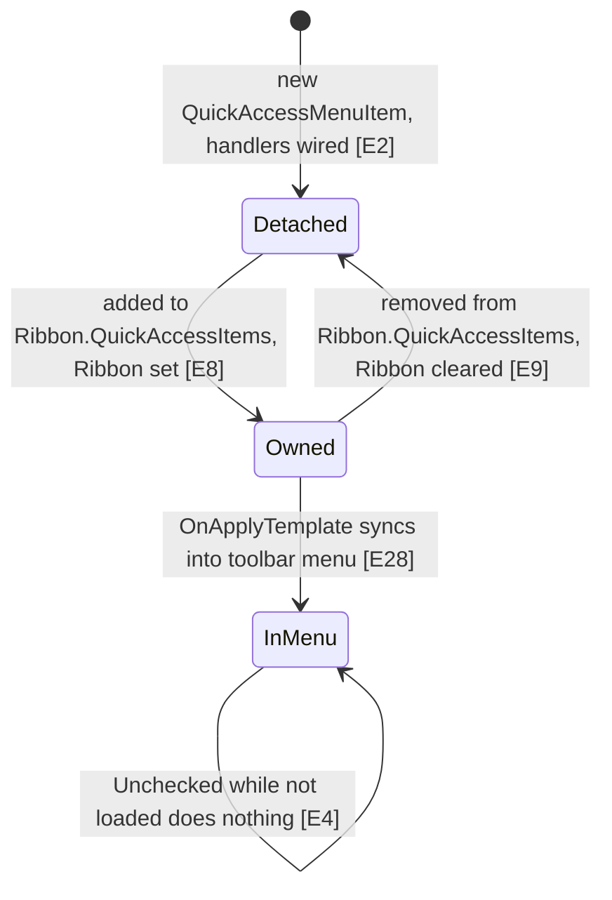
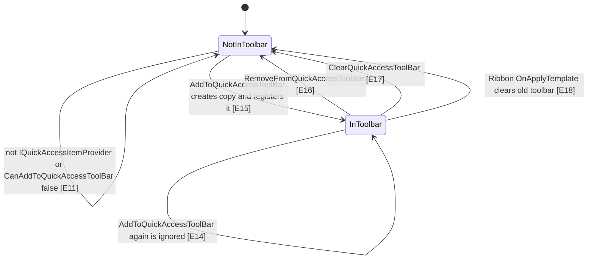
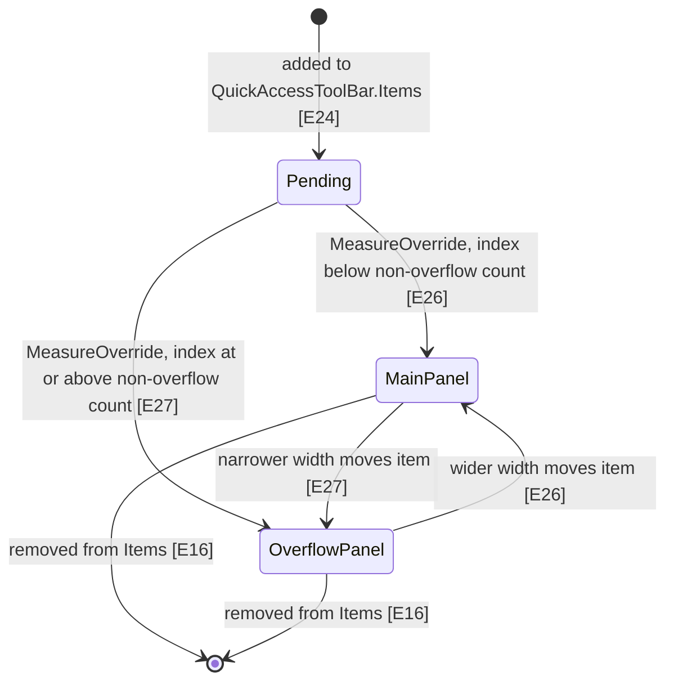

# Quick Access Toolbar

The Quick Access Toolbar (QAT) is the small row of buttons above (or below) the ribbon. The app lists candidate commands in a drop-down menu; each menu entry has a check mark, and checking it puts a copy of the original ribbon control on the toolbar, unchecking takes the copy away. The user can also right-click a ribbon control and choose "Add to Quick Access Toolbar". The ribbon remembers only whether the toolbar sits above or below the ribbon; it does not save which buttons are on it.

Scope: this describes the code at the current checkout (branch `claude/affectionate-pascal-2qipcf`). The #1251 fork change (a `QuickAccessMenuItem.Ribbon` setter that adds checked items when the toolbar exists) is **not** in this checkout: `Ribbon` is a plain auto-property here [E1]. That setter exists only in commit `0aa21a33` / `e44b57f6` on other branches (seen with `git show`), which is not an ancestor of this checkout's `HEAD`.

## State diagram

Lifecycle of one `QuickAccessMenuItem` (a check-mark entry in the QAT drop-down menu):



Lifecycle of one ribbon element (the original control, the key of `QuickAccessElements`):



Placement of one toolbar copy inside the QAT control:



## Evidence

| ID | Claim | Location | Code |
|----|-------|----------|------|
| E1 | In this checkout `QuickAccessMenuItem.Ribbon` is a plain internal auto-property with no setter logic (no #1251 change). | `Fluent.Ribbon/Controls/QuickAccessMenuItem.cs:41` | `internal Ribbon? Ribbon { get; set; }` |
| E2 | The constructor wires Checked, Unchecked and two Loaded handlers. | `Fluent.Ribbon/Controls/QuickAccessMenuItem.cs:59` | `this.Loaded += this.OnFirstLoaded;` |
| E3 | OnChecked calls `AddToQuickAccessToolBar(Target)` on the owning ribbon (no-op if `Ribbon` is null). | `Fluent.Ribbon/Controls/QuickAccessMenuItem.cs:143` | `this.Ribbon?.AddToQuickAccessToolBar(this.Target);` |
| E4 | OnUnchecked returns early when the item is not loaded; otherwise it calls `RemoveFromQuickAccessToolBar(Target)`. | `Fluent.Ribbon/Controls/QuickAccessMenuItem.cs:148` | `if (this.IsLoaded == false)` |
| E5 | OnFirstLoaded unsubscribes itself, then adds the Target if the item is checked. | `Fluent.Ribbon/Controls/QuickAccessMenuItem.cs:171` | `this.Loaded -= this.OnFirstLoaded;` |
| E6 | OnItemLoaded (every Loaded) overwrites IsChecked with whether the Target is in the toolbar. | `Fluent.Ribbon/Controls/QuickAccessMenuItem.cs:165` | `this.IsChecked = this.Ribbon.IsInQuickAccessToolBar(this.Target);` |
| E7 | `QuickAccessItemsProvider.IsSupported` requires `IQuickAccessItemProvider` with `CanAddToQuickAccessToolBar` true. | `Fluent.Ribbon/Controls/QuickAccessMenuItem.cs:198` | `&& provider.CanAddToQuickAccessToolBar)` |
| E8 | Adding a `QuickAccessMenuItem` to `Ribbon.QuickAccessItems` sets its `Ribbon` to that ribbon. | `Fluent.Ribbon/Controls/Ribbon.cs:950` | `item.Ribbon = this;` |
| E9 | Removing it from `Ribbon.QuickAccessItems` sets `Ribbon` to null; the handler has no `Reset` case. | `Fluent.Ribbon/Controls/Ribbon.cs:958` | `item.Ribbon = null;` |
| E10 | The ribbon tracks toolbar content as a dictionary: original element to toolbar copy. | `Fluent.Ribbon/Controls/Ribbon.cs:756` | `protected Dictionary<UIElement, UIElement> QuickAccessElements { get; } = new();` |
| E11 | `AddToQuickAccessToolBar` silently returns for unsupported elements. | `Fluent.Ribbon/Controls/Ribbon.cs:1775` | `if (QuickAccessItemsProvider.IsSupported(element) == false)` |
| E12 | A `Gallery` passed to `AddToQuickAccessToolBar` is replaced by its nearest logical `IRibbonControl` parent. | `Fluent.Ribbon/Controls/Ribbon.cs:1759` | `if (element is Gallery)` |
| E13 | "In toolbar" means the original element is a key of `QuickAccessElements`. | `Fluent.Ribbon/Controls/Ribbon.cs:1745` | `return this.QuickAccessElements.ContainsKey(element);` |
| E14 | Adding only happens when the element is not already in the toolbar. | `Fluent.Ribbon/Controls/Ribbon.cs:1780` | `if (this.IsInQuickAccessToolBar(element) == false)` |
| E15 | Add registers the pair in the dictionary, then adds the copy to the toolbar only if the toolbar exists. | `Fluent.Ribbon/Controls/Ribbon.cs:1789` | `this.QuickAccessToolBar?.Items.Add(control);` |
| E16 | Remove deletes the dictionary entry and removes the copy from the toolbar items. | `Fluent.Ribbon/Controls/Ribbon.cs:1828` | `this.QuickAccessToolBar?.Items.Remove(quickAccessItem);` |
| E17 | `ClearQuickAccessToolBar` empties both the dictionary and the toolbar items. | `Fluent.Ribbon/Controls/Ribbon.cs:1837` | `this.QuickAccessElements.Clear();` |
| E18 | On re-templating, `Ribbon.OnApplyTemplate` clears the old toolbar and empties the old sync target. | `Fluent.Ribbon/Controls/Ribbon.cs:1629` | `this.ClearQuickAccessToolBar();` |
| E19 | The new `PART_QuickAccessToolBar` gets a one-way sync from `Ribbon.QuickAccessItems` into its own `QuickAccessItems`. | `Fluent.Ribbon/Controls/Ribbon.cs:1638` | `this.quickAccessItemsSync = new CollectionSyncHelper<QuickAccessMenuItem>(this.QuickAccessItems, this.QuickAccessToolBar.QuickAccessItems);` |
| E20 | `CollectionSyncHelper` subscribes to the source in its constructor and has no unsubscribe method. | `Fluent.Ribbon/Collections/CollectionSyncHelper.cs:23` | `this.Source.CollectionChanged += this.SourceOnCollectionChanged;` |
| E21 | The "Add to QAT" context-menu entries pass the right-clicked control (`PlacementTarget`) as command parameter. | `Fluent.Ribbon/Controls/Ribbon.cs:174` | `nameof(System.Windows.Controls.ContextMenu.PlacementTarget), System.Windows.Controls.MenuItem.CommandParameterProperty` |
| E22 | The context menu shows "Remove" only when the right-clicked control is a toolbar copy (a dictionary value). | `Fluent.Ribbon/Controls/Ribbon.cs:413` | `if (ribbon.QuickAccessElements.ContainsValue(control)` |
| E23 | The Add command executes `AddToQuickAccessToolBar` with its parameter; the Remove command maps the copy back to its original via `First`. | `Fluent.Ribbon/Controls/Ribbon.cs:1424` | `var element = ribbon.QuickAccessElements.First(x => ReferenceEquals(x.Value, e.Parameter)).Key;` |
| E24 | Changing `QuickAccessToolBar.Items` refreshes overflow state, key tips, margins and raises `ItemsChanged`. | `Fluent.Ribbon/Controls/QuickAccessToolBar.cs:113` | `this.UpdateKeyTips();` |
| E25 | QAT menu items are inserted into the drop-down at index + 1 (after the header item) and only if `MenuDownButton` exists. | `Fluent.Ribbon/Controls/QuickAccessToolBar.cs:214` | `this.MenuDownButton.Items.Insert(index + 1, item);` |
| E26 | During measure the first `cachedNonOverflowItemsCount` items go into `PART_ToolBarPanel`. | `Fluent.Ribbon/Controls/QuickAccessToolBar.cs:468` | `this.toolBarPanel.Children.Add(this.Items[i]);` |
| E27 | The remaining items go into `PART_ToolBarOverflowPanel`. | `Fluent.Ribbon/Controls/QuickAccessToolBar.cs:498` | `this.toolBarOverflowPanel?.Children.Add(this.Items[i]);` |
| E28 | `QuickAccessToolBar.OnApplyTemplate` re-inserts all `QuickAccessItems` into the new `PART_MenuDownButton`. | `Fluent.Ribbon/Controls/QuickAccessToolBar.cs:380` | `this.MenuDownButton.Items.Insert(i + 1, this.QuickAccessItems[i]);` |
| E29 | Default key tips: items 1-9 get "1".."9", items 10-18 get "09".."01", items 19-44 get "0A".."0Z"; a custom `UpdateKeyTipsAction` replaces this. | `Fluent.Ribbon/Controls/QuickAccessToolBar.cs:611` | `KeyTip.SetKeys(quickAccessToolBar.Items[i], "0" + startChar++);` |
| E30 | `QuickAccessToolBar.ShowAboveRibbon` is two-way bound to `Ribbon.ShowQuickAccessToolBarAboveRibbon` in the ribbon template. | `Fluent.Ribbon/Themes/Controls/Ribbon.xaml:41` | `ShowAboveRibbon="{Binding ShowQuickAccessToolBarAboveRibbon, Mode=TwoWay, RelativeSource={RelativeSource TemplatedParent}}" />` |
| E31 | Changing `ShowQuickAccessToolBarAboveRibbon` moves the QAT into or out of the title bar and saves temporary state. | `Fluent.Ribbon/Controls/Ribbon.cs:837` | `ribbon.RibbonStateStorage.SaveTemporary();` |
| E32 | The saved (and loaded) ribbon state holds only IsMinimized, ShowQuickAccessToolBarAboveRibbon and IsSimplified; no QAT items. | `Fluent.Ribbon/Data/RibbonStateStorage.cs:163` | `builder.Append(this.ribbon.ShowQuickAccessToolBarAboveRibbon.ToString(CultureInfo.InvariantCulture));` |
| E33 | `RibbonControl.BindQuickAccessItem` binds DataContext, fonts, IsEnabled, command properties etc. one-way from original to copy. | `Fluent.Ribbon/Controls/RibbonControl.cs:266` | `Bind(source, target, nameof(source.DataContext), DataContextProperty, BindingMode.OneWay);` |
| E34 | For toggle-like sources and targets, IsChecked is bound two-way between original and copy. | `Fluent.Ribbon/Controls/RibbonControl.cs:303` | `Bind(source, target, nameof(System.Windows.Controls.Primitives.ToggleButton.IsChecked), System.Windows.Controls.Primitives.ToggleButton.IsCheckedProperty, BindingMode.TwoWay);` |
| E35 | Example `CreateQuickAccessItem`: `Button` builds a new Button, forwards Click to the original, and calls `BindQuickAccessItem`. | `Fluent.Ribbon/Controls/Button.cs:246` | `button.Click += (sender, e) => this.RaiseEvent(e);` |
| E36 | Changing `CanAddToQuickAccessToolBar` only re-coerces the ContextMenu; it does not touch the toolbar. | `Fluent.Ribbon/Controls/RibbonControl.cs:443` | `d.CoerceValue(ContextMenuProperty);` |
| E37 | On `Reset` the QAT unhooks SizeChanged only from items still in `Items` (after `Clear` there are none). | `Fluent.Ribbon/Controls/QuickAccessToolBar.cs:134` | `foreach (var item in this.Items.OfType<FrameworkElement>())` |
| E38 | `Gallery` derives from `ListBox` and does not implement `IQuickAccessItemProvider`. | `Fluent.Ribbon/Controls/Gallery.cs:21` | `public class Gallery : ListBox` |
| E39 | The Add CanExecute has a `Gallery` branch placed after an `IsSupported(element)` check. | `Fluent.Ribbon/Controls/Ribbon.cs:1506` | `if (e.Parameter is Gallery gallery)` |
| E40 | The Showcase declares QAT entries in XAML under `Ribbon.QuickAccessItems`, with the target as content or via `Target`. | `Fluent.Ribbon.Showcase/TestContent.xaml:447` | `<Fluent:QuickAccessMenuItem IsChecked="true">` |

## Invariants

- `QuickAccessElements` is the single source of truth for "is in toolbar". Keys are originals, values are copies; `IsInQuickAccessToolBar` checks keys [E10, E13], the context menu and Remove command check values [E22, E23]. Anything that adds to `QuickAccessToolBar.Items` without updating the dictionary (or the reverse) breaks Remove, the check marks and the context menu.
- Each original has at most one copy: Add is guarded by `IsInQuickAccessToolBar` [E14]. A second copy is never made while the entry exists, even if the first one was never shown [E15].
- `QuickAccessMenuItem` only acts when its `Ribbon` is set, and `Ribbon` is only set by adding it to `Ribbon.QuickAccessItems` [E3, E8]. Items added only to `QuickAccessToolBar.QuickAccessItems` directly never get a `Ribbon`.
- A menu item's check mark is derived, not stored: every Loaded overwrites `IsChecked` from the dictionary [E6]. `IsChecked` set in XAML is honoured only by the first Loaded [E5].
- The drop-down menu layout assumes exactly one header item before the QAT entries (`index + 1`) [E25, E28], matching the `GroupSeparatorMenuItem` first child in `Themes/Controls/QuickAccessToolbar.xaml`. Changing the template's item order breaks placement.
- The overflow split depends on `cachedNonOverflowItemsCount` and `itemsHadChanged`; `Items` changes must go through the `ObservableCollection` so `OnItemsCollectionChanged` runs [E24, E26, E27].
- Copies stay in sync with originals only through the bindings made in `GetQuickAccessItem` and `BindQuickAccessItem` [E33, E34]; a new `CreateQuickAccessItem` implementation must call `BindQuickAccessItem` or bind itself [E35].
- Only `IQuickAccessItemProvider` controls with `CanAddToQuickAccessToolBar = true` can enter the toolbar [E7, E11].

## How app code should interact

From XAML (as the Showcase does) [E40]:

```xml
<Fluent:Ribbon.QuickAccessItems>
    <Fluent:QuickAccessMenuItem IsChecked="True" Target="{Binding ElementName=pasteButton}" />
    <Fluent:QuickAccessMenuItem>
        <Fluent:Button Header="Pink" Icon="..." />   <!-- element content becomes Target -->
    </Fluent:QuickAccessMenuItem>
</Fluent:Ribbon.QuickAccessItems>
```

- Put entries in `Ribbon.QuickAccessItems`, not in `QuickAccessToolBar.QuickAccessItems`; only the ribbon's collection sets `Ribbon` on the item [E8, E19].
- `IsChecked="True"` means "start on the toolbar"; it is applied on the item's first Loaded [E5].
- The target must be an `IQuickAccessItemProvider` (for example Fluent's `Button` [E35]) with `CanAddToQuickAccessToolBar` true [E7].

From code:

- To put a control on the toolbar: `ribbon.AddToQuickAccessToolBar(control)`; to take it off: `ribbon.RemoveFromQuickAccessToolBar(control)`; to test: `ribbon.IsInQuickAccessToolBar(control)`; to empty: `ribbon.ClearQuickAccessToolBar()` [E13, E15, E16, E17]. Pass the original control, not the toolbar copy.
- Call these after the ribbon's template is applied (`ribbon.QuickAccessToolBar` not null). Before that the element is registered but its copy is not added to any toolbar [E15].
- To add a menu entry at runtime, add a `QuickAccessMenuItem` to `ribbon.QuickAccessItems` [E8]. In this checkout, setting `IsChecked = true` before adding does not by itself put the target on the toolbar until the item's first Loaded [E1, E5]; call `ribbon.AddToQuickAccessToolBar(item.Target)` if it must show immediately (entry's check mark then follows on its next Loaded [E6]).
- Read the current content with `ribbon.GetQuickAccessElements()` (a copy of the dictionary) [E10].
- Users can also use the built-in context menu, which runs `Ribbon.AddToQuickAccessCommand` / `RemoveFromQuickAccessCommand` [E21, E23].
- To move the toolbar above or below the ribbon, set `Ribbon.ShowQuickAccessToolBarAboveRibbon`; it is two-way bound to the toolbar's `ShowAboveRibbon` and is the only QAT value the state storage saves [E30, E31, E32].
- To prevent a control from being added, set `CanAddToQuickAccessToolBar="False"` [E7]. To change key tips, set `QuickAccessToolBar.UpdateKeyTipsAction` [E29].
- The QAT content is not persisted by `RibbonStateStorage`; if the app wants to remember it, it must save and restore it itself (for example by overriding `Ribbon.CreateRibbonStateStorage` or by its own code using the public methods above) [E32].

## Suspicious findings (unverified)

These are candidates found by reading the code. None has been confirmed by running it.

1. **Known: OnUnchecked ignores unloaded items.** Confirmed present at `Fluent.Ribbon/Controls/QuickAccessMenuItem.cs:148` [E4]. Unchecking an entry from code while the entry is not loaded leaves the target on the toolbar, and the next Loaded then re-checks it [E6]. OnChecked has no such guard [E3], so check and uncheck are asymmetric. Test: add a checked entry, let it load, close the menu, set `IsChecked = false` from code, assert `IsInQuickAccessToolBar(target)`.
2. **Add before the template registers an invisible element.** `Fluent.Ribbon/Controls/Ribbon.cs:1788-1789` [E15]. If `QuickAccessToolBar` is null, the pair is still added to `QuickAccessElements` but the copy goes nowhere. When the template is applied later, `OnApplyTemplate` only clears if an old toolbar existed [E18], and nothing adds existing dictionary values to the new toolbar. After that, `IsInQuickAccessToolBar` returns true, so the element can never be added again [E14]. Test: create a `Ribbon` without applying its template, call `AddToQuickAccessToolBar(button)`, then `ApplyTemplate()`; assert `QuickAccessToolBar.Items.Count`.
3. **Ribbon re-templating loses QAT content.** `Fluent.Ribbon/Controls/Ribbon.cs:1627-1631` [E18]. `ClearQuickAccessToolBar` empties the dictionary, and `OnFirstLoaded` has already unsubscribed [E5], so checked entries are not re-added; the next Loaded then sets their `IsChecked` to false [E6]. Test: load a ribbon with checked entries, assign a new copy of its `Template`, run layout, check `QuickAccessToolBar.Items.Count`.
4. **Old sync helper keeps running after re-templating.** `Fluent.Ribbon/Controls/Ribbon.cs:1638` and `Fluent.Ribbon/Collections/CollectionSyncHelper.cs:23` [E19, E20]. The old `CollectionSyncHelper` is never unsubscribed, so later changes to `Ribbon.QuickAccessItems` are also pushed into the old toolbar's `QuickAccessItems` (and its `MenuDownButton`), placing one `QuickAccessMenuItem` in two parents. Test: re-template the ribbon, then add a `QuickAccessMenuItem` to `ribbon.QuickAccessItems`; check for an exception or for the item in the old toolbar's collection.
5. **`Reset` is not handled for menu entries.** `Fluent.Ribbon/Controls/Ribbon.cs:945` (switch with Add/Remove/Replace only) and `Fluent.Ribbon/Controls/QuickAccessToolBar.cs:208` (same) [E9, E25]. `ribbon.QuickAccessItems.Clear()` leaves `item.Ribbon` set on every removed entry. The sync helper then clears `QuickAccessToolBar.QuickAccessItems`, which raises another Reset that the toolbar also ignores, so the entries stay inside `MenuDownButton.Items`. Test: add entries, open the menu, call `ribbon.QuickAccessItems.Clear()`, inspect `QuickAccessToolBar.MenuDownButton.Items`.
6. **Removing a menu entry does not remove its target from the toolbar.** `Fluent.Ribbon/Controls/Ribbon.cs:958` [E9]. Only `item.Ribbon = null` runs; the target stays in `QuickAccessElements` and on the toolbar with no menu entry to uncheck it. Could be intended. Test: add a checked entry, remove it from `ribbon.QuickAccessItems`, assert `IsInQuickAccessToolBar(target)`.
7. **SizeChanged handlers leak on Clear.** `Fluent.Ribbon/Controls/QuickAccessToolBar.cs:132-137` [E37]. `ObservableCollection.Clear` raises `Reset` with no `OldItems`, and the Reset branch iterates `this.Items`, which is already empty, so cleared copies keep a `SizeChanged` handler pointing at the toolbar. Test: add a copy, call `ClearQuickAccessToolBar()`, then change the old copy's size and observe whether `OnChildSizeChanged` runs (debugger or a subclass hook).
8. **Unreachable Gallery branch in Add CanExecute.** `Fluent.Ribbon/Controls/Ribbon.cs:1503-1508` [E38, E39]. `IsSupported(element)` is required first, but `Gallery` is not an `IQuickAccessItemProvider`, so `e.Parameter is Gallery` can never be true there; right-clicking a plain `Gallery` yields CanExecute false even though `AddToQuickAccessToolBar` itself redirects galleries to their parent [E12]. Test: call `Ribbon.AddToQuickAccessCommand.CanExecute(gallery, ribbon)` for a gallery inside a `DropDownButton`.
9. **Turning off `CanAddToQuickAccessToolBar` leaves the item on the toolbar.** `Fluent.Ribbon/Controls/RibbonControl.cs:443` [E36]. The change callback only re-coerces the ContextMenu; an element already in `QuickAccessElements` stays. Could be intended. Test: add a button, set `CanAddToQuickAccessToolBar = false`, check `QuickAccessToolBar.Items`.

## Open questions

- When exactly a `QuickAccessMenuItem` inside the drop-down receives `Loaded` (with the ribbon, or only when the popup opens). The #1251 commit message on another branch claims XAML items load with the ribbon and code-added items only when the menu opens; this is WPF runtime behaviour and cannot be proven from this code.
- Whether, during XAML parsing, `IsChecked="True"` is applied before or after the item is added to `Ribbon.QuickAccessItems` (which decides whether OnChecked fires with `Ribbon` still null [E3, E8]).
- Whether WPF runs the `RemoveFromQuickAccessCommand` handler without a prior CanExecute check; if so, `First(...)` [E23] would throw for a parameter that is not a toolbar copy.
- `IRibbonStateStorage.LoadTemporary` is never called inside the library (only `SaveTemporary` is [E31]); what uses the temporary memory stream is not visible in this code.
- Whether the #1251 setter change is intended to be merged into this branch; it is not present in this checkout [E1].
