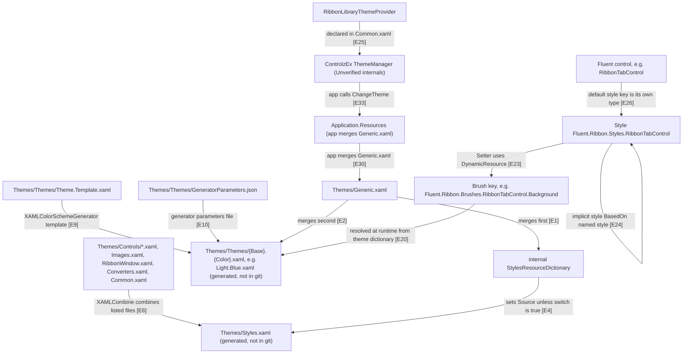

# Theming and styles

Fluent.Ribbon ships its look as two parts: one big file with the control styles (`Styles.xaml`) and one color file per theme (for example `Light.Blue.xaml`). Both are made at build time from smaller source files. An app includes `Themes/Generic.xaml`, which pulls in the styles plus the Light.Blue colors. The control styles look up every color by name while the app runs, so an app can change the theme, or replace one named brush, without touching the controls themselves.

## Loading flow



## Evidence

| ID | Claim | Location | Code |
|----|-------|----------|------|
| E1 | Generic.xaml first merges the internal StylesResourceDictionary. | `Fluent.Ribbon/Themes/Generic.xaml:4` | `<internal:StylesResourceDictionary />` |
| E2 | Generic.xaml then merges the Light.Blue theme, so Light.Blue is the default theme. | `Fluent.Ribbon/Themes/Generic.xaml:5` | `<ResourceDictionary Source="pack://application:,,,/Fluent;component/Themes/Themes/Light.Blue.xaml" />` |
| E3 | StylesResourceDictionary reads the AppContext switch Switch.Fluent.Ribbon.DisableDefaultStyleLoading. | `Fluent.Ribbon/Internal/StylesResourceDictionary.cs:18` | `if (AppContext.TryGetSwitch("Switch.Fluent.Ribbon.DisableDefaultStyleLoading", out var enabled) is false` |
| E4 | If the switch is missing or false, it loads Themes/Styles.xaml. If it is true, the dictionary stays empty. | `Fluent.Ribbon/Internal/StylesResourceDictionary.cs:21` | `this.Source = new("/Fluent;component/Themes/Styles.xaml", UriKind.Relative);` |
| E5 | The documented way to set the switch is a RuntimeHostConfigurationOption in the app project. | `Fluent.Ribbon/Internal/StylesResourceDictionary.cs:11` | `&lt;RuntimeHostConfigurationOption Include="Switch.Fluent.Ribbon.DisableDefaultStyleLoading" Value="true" /&gt;` |
| E6 | The files combined into Styles.xaml are Controls/*.xaml, Images.xaml, RibbonWindow.xaml, Converters.xaml and Common.xaml. | `Fluent.Ribbon/Fluent.Ribbon.csproj:53` | `<FilesForXamlCombine>Themes\Controls\*.xaml;Themes\Images.xaml;Themes\RibbonWindow.xaml;Themes\Converters.xaml;Themes\Common.xaml</FilesForXamlCombine>` |
| E7 | Those files are XAMLCombine items whose output is Themes\Styles.xaml. | `Fluent.Ribbon/Fluent.Ribbon.csproj:66` | `<TargetFile>Themes\Styles.xaml</TargetFile>` |
| E8 | The XAMLCombine and color scheme generator build tasks come from the XAMLTools.MSBuild package. | `Fluent.Ribbon/Fluent.Ribbon.csproj:30` | `<PackageReference Include="XAMLTools.MSBuild" PrivateAssets="all" IncludeAssets="build" />` |
| E9 | Theme files are generated from Theme.Template.xaml. | `Fluent.Ribbon/Fluent.Ribbon.csproj:70` | `<XAMLColorSchemeGeneratorItems Include="Themes\Themes\Theme.Template.xaml">` |
| E10 | The generator input values come from GeneratorParameters.json. | `Fluent.Ribbon/Fluent.Ribbon.csproj:71` | `<ParametersFile>Themes\Themes\GeneratorParameters.json</ParametersFile>` |
| E11 | Generated theme files are written into Themes\Themes. | `Fluent.Ribbon/Fluent.Ribbon.csproj:72` | `<OutputPath>Themes\Themes</OutputPath>` |
| E12 | Styles.xaml and the generated theme files are build outputs and are git-ignored. | `.gitignore:47` | `Fluent.Ribbon/Themes/**/Styles.xaml` |
| E13 | GeneratorParameters.json has DefaultValues shared by all themes. | `Fluent.Ribbon/Themes/Themes/GeneratorParameters.json:2` | `"DefaultValues": {` |
| E14 | BaseColorSchemes are Dark and Light (Dark shown here; Light at line 79). | `Fluent.Ribbon/Themes/Themes/GeneratorParameters.json:35` | `"Name": "Dark",` |
| E15 | Light is the second base color scheme. | `Fluent.Ribbon/Themes/Themes/GeneratorParameters.json:79` | `"Name": "Light",` |
| E16 | ColorSchemes (accents) start here; there are 23 (Amber to Yellow), including Blue. | `Fluent.Ribbon/Themes/Themes/GeneratorParameters.json:123` | `"ColorSchemes": [` |
| E17 | AdditionalColorSchemeVariants contains one variant, Colorful. | `Fluent.Ribbon/Themes/Themes/GeneratorParameters.json:657` | `"Name": "Colorful",` |
| E18 | Each generated theme tags itself with metadata (name, origin, base, color scheme). | `Fluent.Ribbon/Themes/Themes/Theme.Template.xaml:11` | `<system:String x:Key="Theme.Origin">Fluent.Ribbon</system:String>` |
| E19 | Theme brushes are frozen SolidColorBrushes whose Color is a StaticResource to a Color key in the same theme file. | `Fluent.Ribbon/Themes/Themes/Theme.Template.xaml:81` | `<SolidColorBrush x:Key="Fluent.Ribbon.Brushes.AccentBase" Color="{StaticResource Fluent.Ribbon.Colors.AccentBase}" options:Freeze="True" />` |
| E20 | The key Fluent.Ribbon.Brushes.RibbonTabControl.Background is defined in the theme template, filled from a generator value. | `Fluent.Ribbon/Themes/Themes/Theme.Template.xaml:224` | `<SolidColorBrush x:Key="Fluent.Ribbon.Brushes.RibbonTabControl.Background" Color="{{Fluent.Ribbon.Brushes.RibbonTabControl.Background}}" options:Freeze="True" />` |
| E21 | Its value is Transparent in the Light base scheme (and also in Dark at line 54). | `Fluent.Ribbon/Themes/Themes/GeneratorParameters.json:98` | `"Fluent.Ribbon.Brushes.RibbonTabControl.Background": "Transparent",` |
| E22 | The named RibbonTabControl style exists. | `Fluent.Ribbon/Themes/Controls/RibbonTabControl.xaml:110` | `<Style x:Key="Fluent.Ribbon.Styles.RibbonTabControl"` |
| E23 | That style sets Background with DynamicResource, not StaticResource. | `Fluent.Ribbon/Themes/Controls/RibbonTabControl.xaml:112` | `<Setter Property="Background" Value="{DynamicResource Fluent.Ribbon.Brushes.RibbonTabControl.Background}" />` |
| E24 | Common.xaml defines implicit styles BasedOn named styles. The StaticResource here points to a Style, not a brush. | `Fluent.Ribbon/Themes/Common.xaml:158` | `BasedOn="{StaticResource Fluent.Ribbon.Styles.RibbonTabControl}" />` |
| E25 | Common.xaml (part of Styles.xaml) declares the RibbonLibraryThemeProvider instance as a resource. | `Fluent.Ribbon/Themes/Common.xaml:6` | `<theming:RibbonLibraryThemeProvider x:Key="{x:Static theming:RibbonLibraryThemeProvider.DefaultInstance}" />` |
| E26 | RibbonTabControl sets its default style key to its own type. | `Fluent.Ribbon/Controls/RibbonTabControl.cs:427` | `DefaultStyleKeyProperty.OverrideMetadata(type, new FrameworkPropertyMetadata(typeof(RibbonTabControl)));` |
| E27 | The template binds the grid Background to the control's Background property, so a local or style value flows into the template. | `Fluent.Ribbon/Themes/Controls/RibbonTabControl.xaml:133` | `Background="{TemplateBinding Background}"` |
| E28 | RibbonLibraryThemeProvider is Fluent.Ribbon's ControlzEx LibraryThemeProvider. | `Fluent.Ribbon/Theming/RibbonLibraryThemeProvider.cs:12` | `public class RibbonLibraryThemeProvider : LibraryThemeProvider` |
| E29 | It supplies Fluent.Ribbon color values for runtime-generated themes. | `Fluent.Ribbon/Theming/RibbonLibraryThemeProvider.cs:28` | `values.Add("Fluent.Ribbon.Colors.AccentBase", colorValues.AccentColor.ToString());` |
| E30 | The showcase app merges Generic.xaml into Application.Resources. | `Fluent.Ribbon.Showcase/App.xaml:9` | `<ResourceDictionary Source="pack://application:,,,/Fluent;component/Themes/Generic.xaml" />` |
| E31 | The showcase shows (commented out) merging a different theme file after Generic.xaml. | `Fluent.Ribbon.Showcase/App.xaml:11` | `<!--<ResourceDictionary Source="pack://application:,,,/Fluent;component/Themes/Themes/Light.Green.xaml" />-->` |
| E32 | The showcase syncs the theme with the OS app mode through ControlzEx ThemeManager. | `Fluent.Ribbon.Showcase/App.xaml.cs:40` | `ThemeManager.Current.ThemeSyncMode = ThemeSyncMode.SyncWithAppMode;` |
| E33 | The showcase changes the whole theme with ThemeManager.ChangeTheme. | `Fluent.Ribbon.Showcase/ViewModels/ColorViewModel.cs:101` | `ThemeManager.Current.ChangeTheme(Application.Current, value);` |
| E34 | The showcase changes only the base color (Light/Dark) with ChangeThemeBaseColor. | `Fluent.Ribbon.Showcase/ViewModels/ColorViewModel.cs:84` | `ThemeManager.Current.ChangeThemeBaseColor(Application.Current, value);` |
| E35 | The showcase changes only the accent with ChangeThemeColorScheme. | `Fluent.Ribbon.Showcase/ViewModels/IssueRepros/ThemeManagerFromThread.cs:88` | `var newTheme = ThemeManager.Current.ChangeThemeColorScheme(Application.Current, themeColor.ToString());` |
| E36 | The showcase builds a theme for an arbitrary accent color with RuntimeThemeGenerator. | `Fluent.Ribbon.Showcase/Helpers/ThemeHelper.cs:17` | `var theme = RuntimeThemeGenerator.Current.GenerateRuntimeTheme(baseColorScheme, accentBaseColor, false)!;` |
| E37 | Where C# code needs a theme brush, it uses a resource reference (dynamic), not a fixed value. | `Fluent.Ribbon/Controls/BackstageAdorner.cs:66` | `this.background.SetResourceReference(Shape.FillProperty, "Fluent.Ribbon.Brushes.White");` |
| E38 | The assembly declares its generic theme dictionary lives in the source assembly (Themes/Generic.xaml). | `Shared/GlobalAssemblyInfo.cs:12` | `[assembly: ThemeInfo(ResourceDictionaryLocation.None, ResourceDictionaryLocation.SourceAssembly)]` |
| E39 | The test setup also adds Generic.xaml to Application.Resources.MergedDictionaries. | `Fluent.Ribbon.Tests/AssemblySetup.cs:19` | `app.Resources.MergedDictionaries.Add((ResourceDictionary)Application.LoadComponent(new Uri("/Fluent;component/Themes/Generic.xaml", UriKind.Relative)));` |
| E40 | The switch was added for startup time (issue #1267). | `Changelog.md:12` | `Added AppContext-Switch "Switch.Fluent.Ribbon.DisableDefaultStyleLoading" to disable default style loading.` |

## DynamicResource vs StaticResource

Commands run from the repo root, and their results:

```
grep -o '{DynamicResource Fluent.Ribbon.Brushes' Fluent.Ribbon/Themes/Controls/*.xaml | wc -l   -> 571
grep -o '{StaticResource Fluent.Ribbon.Brushes' Fluent.Ribbon/Themes/Controls/*.xaml | wc -l    -> 0
grep -o '{DynamicResource Fluent.Ribbon.Brushes' Fluent.Ribbon/Themes/*.xaml | wc -l            -> 13
grep -o '{StaticResource Fluent.Ribbon.Brushes' Fluent.Ribbon/Themes/*.xaml | wc -l             -> 0
grep -n '{StaticResource Fluent.Ribbon.\(Colors\|Brushes\)' Fluent.Ribbon/Themes/*.xaml Fluent.Ribbon/Themes/Controls/*.xaml | wc -l  -> 0
grep -c '{StaticResource Fluent.Ribbon.Colors' Fluent.Ribbon/Themes/Themes/Theme.Template.xaml  -> 94
grep -c 'options:Freeze="True"' Fluent.Ribbon/Themes/Themes/Theme.Template.xaml                 -> 143
```

What this means:

- Every brush reference in the control styles and templates (the source of `Styles.xaml`) is a `DynamicResource`: 571 in `Controls/*.xaml` and 13 more in `Themes/*.xaml` (for example `Images.xaml`, `RibbonWindow.xaml`). None is a `StaticResource`. See E23.
- The `StaticResource` uses that do exist in the control files point at styles and converters (for example `BasedOn="{StaticResource Fluent.Ribbon.Styles.RibbonTabControl}"`, E24), not at brushes or colors.
- `StaticResource` is used inside the theme file itself: each brush takes its `Color` from a `Fluent.Ribbon.Colors.*` key with `StaticResource`, and the brush is frozen (E19). So the brush value is fixed when that theme file loads.
- For overriding this means:
  - Override **brush keys** (`Fluent.Ribbon.Brushes.*`). A control's DynamicResource lookup finds the nearest definition of that key, so a brush with the same key placed where WPF finds it first is used, and replacing it later updates the controls. The lookup rule is WPF framework behavior, not code in this repo.
  - Overriding a **color key** (`Fluent.Ribbon.Colors.*`) in app resources is not enough to recolor the theme's brushes, because those brushes already resolved their color with StaticResource inside the theme file (E19). To change colors for all brushes, use a different or generated theme (E33 to E36).
  - Because the theme brushes are frozen (E19), code cannot change a theme brush's `Color` in place. Put a new brush under the key.

## Invariants

- `Generic.xaml` must be reachable by the app. It holds the styles (through `StylesResourceDictionary`) and one theme (E1, E2, E30, E39).
- Only one Fluent.Ribbon theme dictionary should be active at a time. Generic.xaml brings Light.Blue (E2), and ThemeManager swaps theme dictionaries (E33). The swap mechanics are Unverified (depends on ControlzEx).
- Control styles never hold brushes directly. They only reference `Fluent.Ribbon.Brushes.*` keys with DynamicResource (E23, and the counts above), and code uses `SetResourceReference` (E37). Every key used must be defined by the theme. A script check of all 117 used `Fluent.Ribbon.Brushes.*` keys found none missing from the template (see Suspicious findings).
- Every `{{placeholder}}` in `Theme.Template.xaml` must be given a value by `DefaultValues`, the chosen base scheme, or the chosen color scheme (E13 to E17, E20, E21). A script check over all 2 x 23 combinations found no gaps.
- Theme brushes are frozen and built from Color keys with StaticResource in the same file, so Color keys must be defined above the brushes that use them (E19).
- The implicit styles in `Common.xaml` depend on the named styles from the other combined files (E24, E6). This is why the files are combined into one `Styles.xaml` (E7). In Rider builds the files are instead compiled as separate pages (`Fluent.Ribbon/Fluent.Ribbon.csproj:61`).
- When `Switch.Fluent.Ribbon.DisableDefaultStyleLoading` is true, `Styles.xaml` is not loaded through Generic.xaml (E3, E4). The app then has to load the styles itself, or controls have no templates. What the app should load instead is not documented in code (see Open questions).
- Generated files (`Styles.xaml`, `Themes/Themes/*.xaml` except the template) are not in git. They only exist after a build (E12).

## How app code should interact

1. **Get the default look.** Merge `pack://application:,,,/Fluent;component/Themes/Generic.xaml` into `Application.Resources` (E30, E39). That gives Styles.xaml plus Light.Blue (E1, E2).
2. **Pick a different fixed theme in XAML.** Merge a generated theme file after Generic.xaml, for example `Themes/Themes/Light.Green.xaml` or `Dark.Green.xaml`, as the showcase shows in comments (E31). Available names come from `{Light, Dark}` x 23 color schemes (E14 to E16), plus the Colorful variant (E17). How the generator names the Colorful files is not visible in this repo (generated files are git-ignored, E12): Unverified (depends on XAMLTools).
3. **Change theme at runtime.** Use ControlzEx `ThemeManager.Current`:
   - whole theme: `ChangeTheme(Application.Current, theme)` (E33),
   - Light/Dark only: `ChangeThemeBaseColor(Application.Current, "Dark")` (E34),
   - accent only: `ChangeThemeColorScheme(Application.Current, "Green")` (E35),
   - follow the Windows app mode: `ThemeSyncMode = ThemeSyncMode.SyncWithAppMode` then `SyncTheme()` (E32).
   How ThemeManager finds Fluent.Ribbon themes and where it inserts them into the merged dictionaries: Unverified (depends on ControlzEx). The repo only shows that Fluent.Ribbon declares a `RibbonLibraryThemeProvider` resource (E25, E28) and tags themes with `Theme.Origin` = Fluent.Ribbon (E18).
4. **Use an arbitrary accent color.** Generate a runtime theme with `RuntimeThemeGenerator.Current.GenerateRuntimeTheme(baseColorScheme, color, false)` and apply it with `ChangeTheme` (E36). Fluent.Ribbon's part is `RibbonLibraryThemeProvider.FillColorSchemeValues`, which supplies the Fluent.Ribbon color values (E29). The generation itself is Unverified (depends on ControlzEx).
5. **Override one brush.** Define a brush with the same key, for example `<SolidColorBrush x:Key="Fluent.Ribbon.Brushes.RibbonTabControl.Background" Color="..." />`, in a resource scope that WPF searches before the theme. Options: directly in `Application.Resources`, in a merged dictionary after Fluent's, or in the `Resources` of the window or ribbon. The styles pick it up because they use DynamicResource (E23, E20). This lookup order is WPF framework behavior. Whether an app-level override placed in a merged dictionary survives a later `ThemeManager.ChangeTheme` depends on where ControlzEx inserts the new theme: Unverified (depends on ControlzEx). An override in the `Resources` of a window or control is searched before `Application.Resources` (WPF behavior), so it is not affected by where the theme sits in the application merged dictionaries.
6. **Override one control instance.** Set the property directly, for example `Background` on a `RibbonTabControl`. The template reads it with `TemplateBinding` (E27). This is ordinary WPF property setting, not a visual-tree walk.
7. **Opt out of default styles** (startup-time optimization) with the AppContext switch (E3, E5, E40).

## What the #1259 guide got wrong

- **Claim: "Fluent.Ribbon loads its theme after app resources and overwrites them."** The library has no C# code that touches `Application.Resources` or `MergedDictionaries`. `grep -rn "MergedDictionaries\|Application.Current.Resources\|\.Resources\[" --include=*.cs Fluent.Ribbon` returns nothing. The theme gets in only because the app merges `Generic.xaml` itself (E30, E39), and Generic.xaml contains only the styles and Light.Blue (E1, E2). Any order between Fluent's theme and the app's own resources is decided by where the app, or ThemeManager when the app calls it (E33), puts the dictionaries. ThemeManager's insertion behavior is Unverified (depends on ControlzEx). The assembly also declares Generic.xaml as its generic theme dictionary (E38). In WPF, theme-level resources are searched after application resources, so that path cannot overwrite app resources either (WPF framework behavior).
- **Claim: "Templates use StaticResource, so brush changes never apply."** Disproved. There are 0 `{StaticResource Fluent.Ribbon.Brushes` and 571 `{DynamicResource Fluent.Ribbon.Brushes` in `Themes/Controls/*.xaml` (counts above, E23). Code-side references also use `SetResourceReference` (E37). Replacing a brush key therefore reaches the controls. The only brush-related StaticResource is inside the theme file, where brushes get their Color from Color keys (E19). That explains why overriding a *Color* key alone may not recolor things. It does not explain brush overrides failing.
- **Claim: "The fix is walking the visual tree and setting Background directly."** Not needed. Supported routes: override the brush key (E20, E23), switch or generate a theme through ThemeManager (E33 to E36), or set the property on the control, which the template picks up by TemplateBinding (E27). A visual-tree walk sets local values on template parts. Local values beat style setters and DynamicResource, so they stop reacting to later theme changes (WPF framework behavior). It also depends on internal template structure, which is not public API.

## Suspicious findings (unverified)

Candidates only. None of these are confirmed bugs.

- No brush key is used without being defined. A script collected every `{DynamicResource Fluent.Ribbon.Brushes.*}` in `Themes/*.xaml` and `Themes/Controls/*.xaml`, plus `SetResourceReference` keys in C#: 117 keys. It compared them with every `x:Key="Fluent.Ribbon.Brushes.*"`: 142 keys. All used keys are defined.
- 25 brush keys are defined in `Theme.Template.xaml` but not used by any library style: `Accent20/40/60/80`, `AccentLight1-3` and `AccentDark1-3` with their `.Foreground` variants, `Black20`, `White20`, `Gray1`, `Gray3`, `Gray4`, `Gray5`, `Gray8`, `Gray9`, `Gray10`. They look like public palette brushes for apps (`Accent80` and `Gray9` are used in `Fluent.Ribbon.Showcase/TestContent.xaml`), so this is probably intentional.
- `Fluent.Ribbon/Themes/Controls/ApplicationMenuItem.xaml` has 15 hard-coded colors (for example line 228 `<GradientStop Color="#3F000000" Offset="0" />`). These parts do not follow the theme and cannot be changed through a brush key.
- `.gitignore:64` un-ignores `Fluent.Ribbon/Themes/Theme.Template.xaml`, but the template actually lives at `Fluent.Ribbon/Themes/Themes/Theme.Template.xaml`, which `.gitignore:48` (`Fluent.Ribbon/Themes/Themes/*.xaml`) matches. The file is tracked anyway (`git ls-files` lists it), so this only affects adding it again.
- Only the Yellow color scheme overrides `Fluent.Ribbon.Colors.IdealForeground` (to Black, `GeneratorParameters.json:639`). This looks intentional for contrast.

## Open questions

- Where exactly does ControlzEx `ThemeManager.ChangeTheme` put the new theme dictionary in `Application.Resources.MergedDictionaries`, and does it remove the Light.Blue dictionary that came in through Generic.xaml? This decides whether app overrides in a merged dictionary survive a theme change. Unverified (depends on ControlzEx).
- How does ControlzEx discover `RibbonLibraryThemeProvider`? Through the `x:Key` resource in Common.xaml (E25), or through `LibraryThemeProvider` registration in the base class (`base(true)`, `RibbonLibraryThemeProvider.cs:21`)? Unverified (depends on ControlzEx).
- With `DisableDefaultStyleLoading` on, what should an app load instead? The repo shows no example. The changelog only says it disables default style loading (E40).
- Names and file names of the generated Colorful variant themes: the generated output is not in git (E12). Unverified (depends on XAMLTools).
- Does WPF's automatic generic-theme lookup (E38) also load `Light.Blue` for apps that never merge Generic.xaml? By WPF rules it should, since Generic.xaml merges it, but nothing in this repo tests that.
